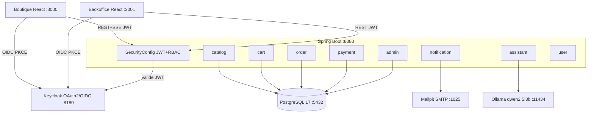
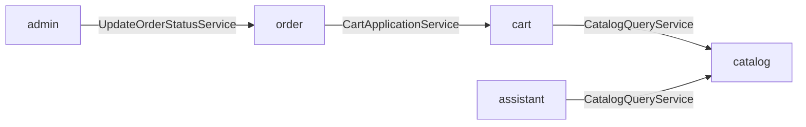
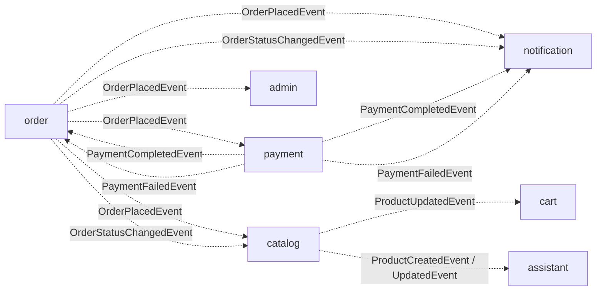
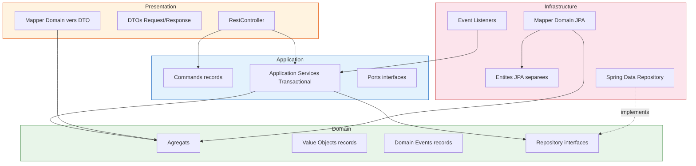
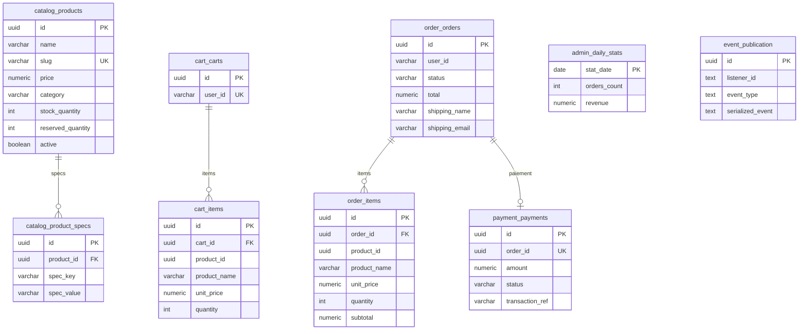
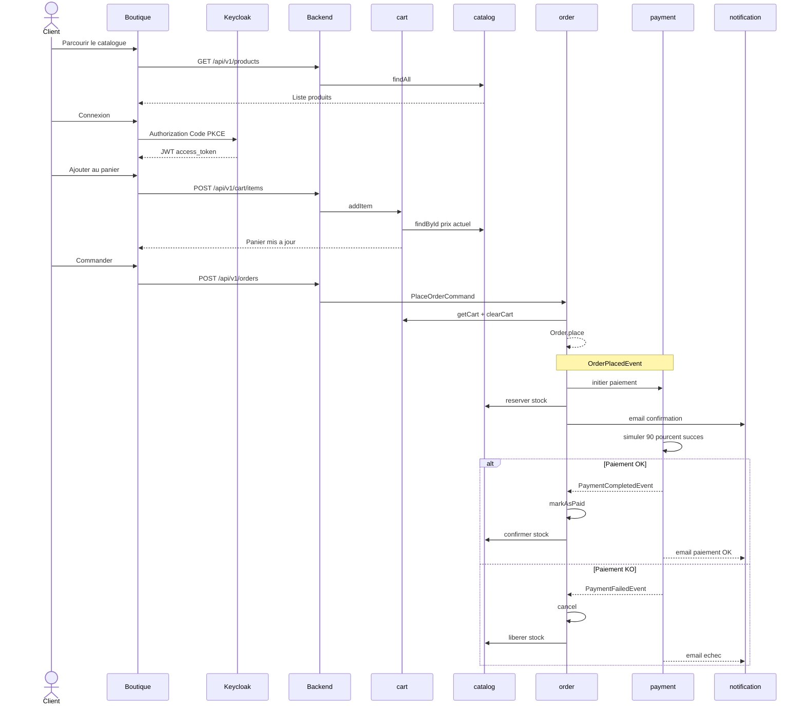
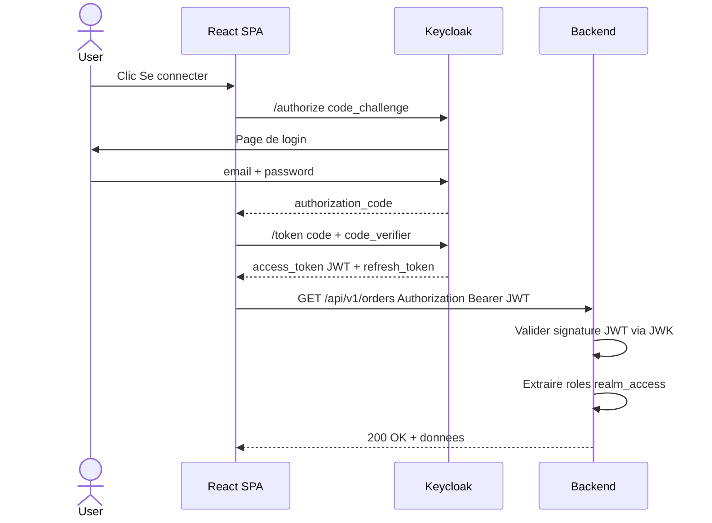
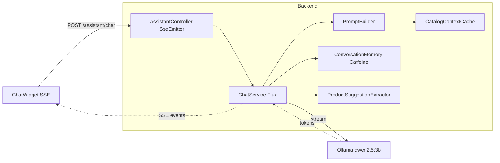

# Architecture — MacMarket

## Vue d'ensemble

MacMarket est une marketplace e-commerce specialisee dans la vente de Mac (MacBook Air, MacBook Pro, iMac, Mac Mini, Mac Studio, Mac Pro). L'application est concue comme un **monolithe modulaire** utilisant Spring Modulith pour organiser le backend en bounded contexts autonomes, avec deux frontends React separes (boutique client et backoffice admin).

## Classification DICP

| Composant | Disponibilite | Integrite | Confidentialite | Preuve |
|-----------|:---:|:---:|:---:|:---:|
| Catalogue produits | 3 | 2 | 1 | 1 |
| Panier | 2 | 2 | 2 | 1 |
| Commandes | 3 | 4 | 3 | 3 |
| Paiement | 4 | 4 | 4 | 4 |
| Authentification (Keycloak) | 4 | 4 | 4 | 3 |
| Admin / Stats | 2 | 2 | 3 | 2 |
| Notification (email) | 1 | 2 | 2 | 2 |
| Assistant IA | 1 | 1 | 1 | 1 |

Echelle : 1 (faible) a 4 (critique)

## Architecture globale



## Bounded Contexts — modules Spring Modulith

Le backend est decoupe en 8 bounded contexts independants. Chaque module communique avec les autres via des **Domain Events** publies par Spring Modulith, jamais par appel direct a l'infrastructure d'un autre module.

### Dependances directes (appels de services)



### Dependances par evenements



### Description des modules

| Module | Responsabilite | Dependances directes | Ecoute events |
|--------|---------------|---------------------|---------------|
| **catalog** | Catalogue produits, stock, CRUD | Aucune | OrderPlacedEvent, OrderStatusChangedEvent |
| **cart** | Panier utilisateur, snapshots produits | catalog | ProductUpdatedEvent |
| **order** | Commandes, checkout, factures PDF | cart | PaymentCompletedEvent, PaymentFailedEvent |
| **payment** | Paiement simule 90% succes | Aucune | OrderPlacedEvent |
| **admin** | Dashboard, stats, gestion commandes | order | OrderPlacedEvent |
| **notification** | Emails transactionnels Thymeleaf | Aucune | 4 events order+payment |
| **assistant** | Chat IA, suggestions produits SSE | catalog | ProductCreated/Updated/DeletedEvent |
| **user** | Endpoint profil utilisateur JWT | Aucune | Aucun |

## Architecture interne d un module — DDD Hexagonale

Chaque bounded context suit la meme structure en couches. La regle de dependance est stricte : les couches internes n ont aucune dependance vers les couches externes.



### Regles architecturales

| Regle | Description |
|-------|-------------|
| Domain pur Java | Aucun import Spring, JPA ou framework dans domain/ |
| Pas de setters | Les agregats exposent des methodes metier, jamais de setters publics |
| Value Objects records | Tous les VOs sont des record Java auto-validants |
| IDs types | Chaque identifiant est un Value Object : ProductId, OrderId, etc. |
| References cross-context | Les IDs d autres modules sont des types locaux : OrderReference, ProductReference |
| Entites JPA separees | Les entites JPA sont dans infrastructure, separees des entites domaine |
| Mapper explicite | Un mapper convertit entre domaine et JPA dans chaque sens |
| Transactional dans application | Jamais dans domain ni infrastructure |
| Controllers sans domaine | Les RestController n importent que la couche application |

## Modele de donnees



### Convention de nommage des tables

Chaque table est prefixee par le nom du bounded context : `catalog_`, `cart_`, `order_`, `payment_`, `admin_`. Aucun module ne fait de requete directe sur les tables d un autre module.

### Separation des entites JPA — module admin

Le module admin definit ses propres entites JPA en lecture seule (`AdminOrderEntity`, `AdminProductEntity`) mappees sur les memes tables, sans dependre de l infrastructure du module order ou catalog.

## Flux metier principal



## Securite

### Flux d authentification OAuth2 OIDC PKCE



### Autorisation RBAC

| Niveau | Endpoints | Roles requis |
|--------|-----------|-------------|
| Public | GET /products, GET /categories, GET /actuator/health | Aucun |
| Authentifie | cart, orders, payments, assistant, users/me | Tout role |
| Gestion | admin/orders, admin/products, admin/customers, admin/dashboard | MANAGER, ADMIN |
| Administration | admin/stats | ADMIN |

## Assistant IA



Le cache catalogue est rafraichi automatiquement via les events ProductCreatedEvent, ProductUpdatedEvent, ProductDeletedEvent.

## Stack technique

| Couche | Technologie | Version |
|--------|------------|---------|
| Runtime | Java | 25 |
| Framework | Spring Boot | 4.1.0 |
| Modularite | Spring Modulith | 2.0.5 |
| IA | Spring AI Ollama | 2.0.0 |
| Base de donnees | PostgreSQL | 17 |
| Migrations | Flyway | integre Spring Boot |
| Cache | Caffeine | integre Spring Boot |
| PDF | Apache PDFBox | 3.0.4 |
| Auth | Keycloak | 26.6.0 |
| Frontend | React + TypeScript | Vite |
| UI | Tailwind CSS v4 + shadcn/ui | — |
| Email | Spring Mail + Thymeleaf | integre |
| SMTP dev | Mailpit | latest |
| Tests | JUnit 5 + Testcontainers | 1.20.6 |
| Conteneurisation | Docker Compose | v2 |

## Deploiement

L application est conteneurisee via Docker Compose avec 7 services :

| Service | Image | Port | Healthcheck |
|---------|-------|------|-------------|
| postgres | postgres:17-alpine | 5432 | pg_isready |
| keycloak | keycloak/keycloak:26.6.0 | 8180 | HTTP /health/ready |
| ollama | ollama/ollama:latest | 11434 | ollama list |
| mailpit | axllent/mailpit:latest | 1025 SMTP / 8025 UI | HTTP /api/v1/info |
| backend | Build local Dockerfile | 8080 | HTTP /actuator/health |
| frontend-shop | Build local Dockerfile | 3000 | HTTP / |
| frontend-admin | Build local Dockerfile | 3001 | HTTP / |

Le service ollama-init est ephemere : il telecharge le modele configure (`OLLAMA_MODEL`, `qwen2.5:3b` par defaut) au premier lancement puis s arrete.

### Profils Spring

| Profil | Usage | Particularites |
|--------|-------|---------------|
| defaut | Configuration de base | URLs localhost, Flyway actif |
| dev | Developpement local | CORS ouvert, password DB en defaut local |
| docker | Docker Compose | URLs internes postgres, keycloak, ollama, mailpit |

## Arborescence du projet

```
spring-modulith/
├── ARCHITECTURE.md              <- ce fichier
├── CLAUDE.md                    <- regles de developpement
├── README.md                    <- guide de demarrage
├── Makefile                     <- commandes dev/ops
├── docker-compose.yml           <- stack complete 7 services
├── docker-compose.dev.yml       <- override dev infra seule
├── keycloak/
│   └── macmarket-realm.json     <- configuration realm + users
├── backend/
│   ├── pom.xml
│   └── src/main/java/com/macmarket/
│       ├── MacMarketApplication.java
│       ├── SecurityConfig.java
│       ├── CorsConfig.java
│       ├── GlobalExceptionHandler.java
│       ├── ErrorResponse.java
│       ├── catalog/             <- bounded context catalogue
│       ├── cart/                <- bounded context panier
│       ├── order/               <- bounded context commandes
│       ├── payment/             <- bounded context paiement
│       ├── admin/               <- bounded context administration
│       ├── notification/        <- bounded context notification
│       ├── assistant/           <- bounded context assistant IA
│       └── user/                <- bounded context utilisateur
├── frontend-shop/               <- React SPA boutique
│   └── src/
│       ├── components/          <- composants UI product, cart, chat
│       ├── pages/               <- pages routees
│       ├── hooks/               <- hooks metier useProducts, useChat
│       ├── stores/              <- state management Zustand
│       └── lib/                 <- API client, auth OIDC
├── frontend-admin/              <- React SPA backoffice
│   └── src/
│       ├── components/          <- composants UI layout, shared
│       ├── pages/               <- pages admin dashboard, stats, CRUD
│       └── lib/                 <- API client, auth OIDC
└── docs/
    ├── adr/                     <- Architecture Decision Records
    └── diagrams/                <- diagrammes supplementaires
```
