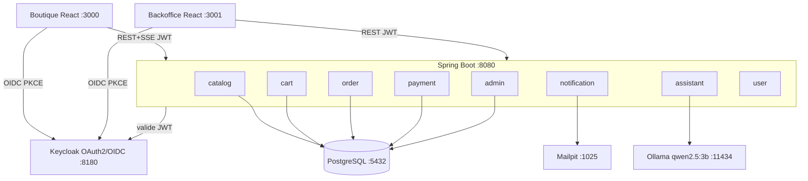
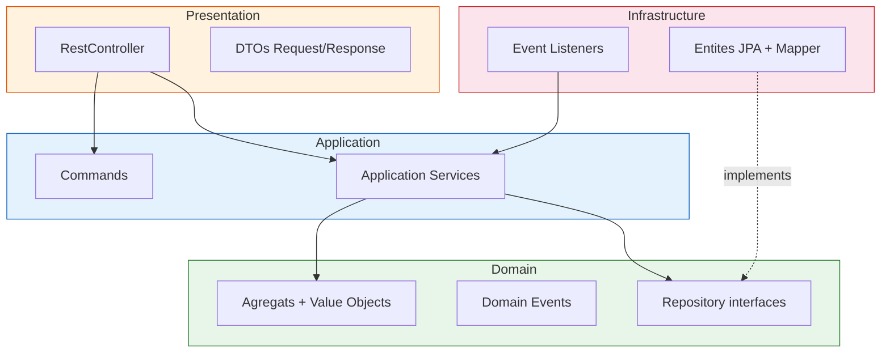
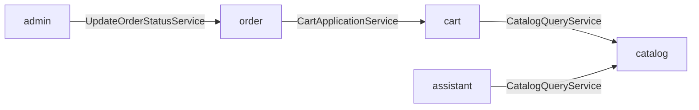
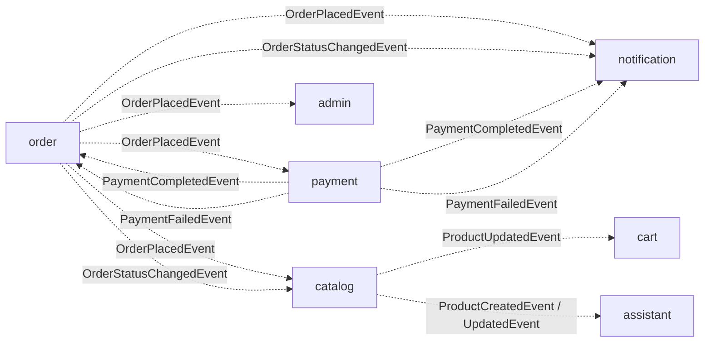
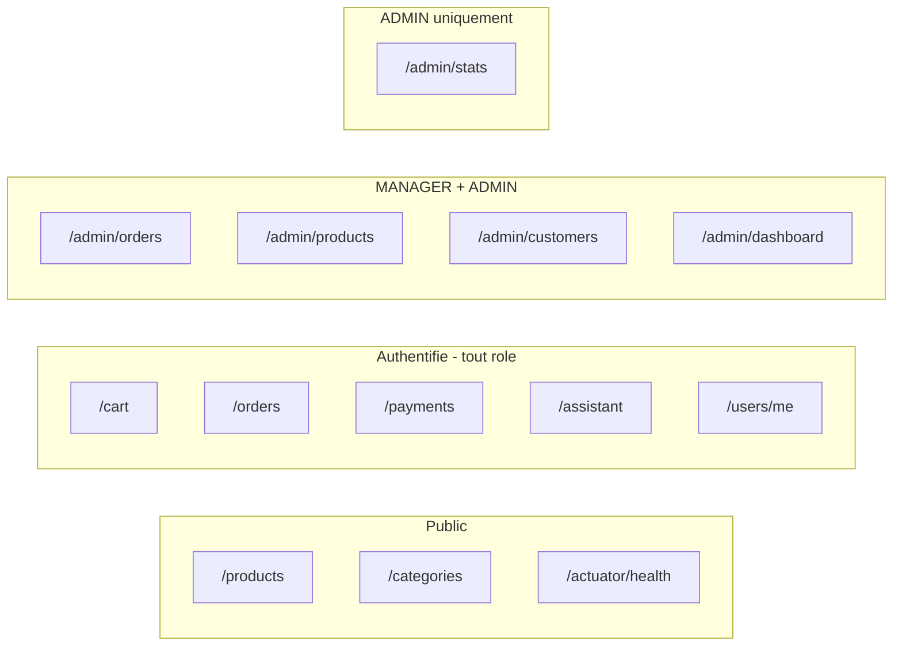

# MacMarket

Marketplace e-commerce pour Mac, construite avec Spring Boot + Spring Modulith, React, PostgreSQL, Keycloak et un assistant IA (Ollama + qwen2.5:3b).

## Prerequis

- **Docker Desktop** (>= 4.30) avec Docker Compose v2
- **Java 25+** (dev local uniquement)
- **Node.js 22+** (dev local uniquement)
- **Espace disque** pour le modele LLM configure (`OLLAMA_MODEL`, telecharge automatiquement)

## Lancement rapide

Premier lancement sur un poste (pull du modele `OLLAMA_MODEL` et generation des `package-lock.json` npm, quelques minutes) :

```bash
make first-time
```

Lancements suivants :

```bash
make up
```

| Service | URL |
|---------|-----|
| Boutique | http://localhost:3000 |
| Backoffice | http://localhost:3001 |
| Backend API | http://localhost:8080 |
| **Documentation API** | **http://localhost:8080/swagger-ui.html** |
| OpenAPI JSON | http://localhost:8080/v3/api-docs |
| Keycloak | http://localhost:8180 (admin/admin) |
| Mailpit | http://localhost:8025 |
| Ollama | http://localhost:11434 |

## Developpement (hot-reload)

```bash
make dev            # lance l'infra (postgres, keycloak, ollama, mailpit)
make backend-run    # terminal 1 — Spring Boot sur 8080
make shop-run       # terminal 2 — boutique sur 5173
make admin-run      # terminal 3 — backoffice sur 5174
```

## Comptes de test

| Email | Mot de passe | Role | Acces |
|-------|-------------|------|-------|
| client@macmarket.com | password | CUSTOMER | Boutique |
| client2@macmarket.com | password | CUSTOMER | Boutique |
| manager@macmarket.com | password | MANAGER | Backoffice (gestion) |
| admin@macmarket.com | password | ADMIN | Backoffice (tout) |

## Commandes utiles

```bash
make help           # liste toutes les commandes
make status         # statut des services
make logs           # logs en temps reel
make test           # tests backend
make db-shell       # psql dans le container
make ollama-status  # verifier le modele LLM
make npm-lockfiles  # regenerer les package-lock.json (registre npm du poste)
make clean          # tout nettoyer
```

> `package-lock.json` n'est pas versionne : le champ `resolved` embarque l'URL du registre npm utilise a la generation (Nexus local vs Artifactory entreprise, voir `.env`). Chaque poste le regenere via `make first-time` ou `make npm-lockfiles`.

## Architecture

- **Backend** : Java 25, Spring Boot 4.1, Spring Modulith 2.0.5, Spring AI 2.0
- **Frontend** : 2 apps React (boutique + backoffice), Vite, TypeScript, Tailwind CSS v4, shadcn/ui
- **Auth** : Keycloak (OAuth2/OIDC, PKCE), 3 roles (CUSTOMER, MANAGER, ADMIN)
- **IA** : Ollama + qwen2.5:3b, Spring AI ChatClient, streaming SSE
- **DB** : PostgreSQL 17, Flyway migrations
- **Email** : Spring Mail + Thymeleaf + Mailpit (dev)
- **PDF** : Apache PDFBox (factures dans le module order)

### Architecture globale



### Architecture DDD par module

Chaque bounded context suit la structure hexagonale / DDD. Les couches internes (domain) n'ont aucune dependance vers les couches externes (infrastructure, presentation).



### Modules Spring Modulith — dependances



### Flux d evenements inter-modules



### Securite RBAC


