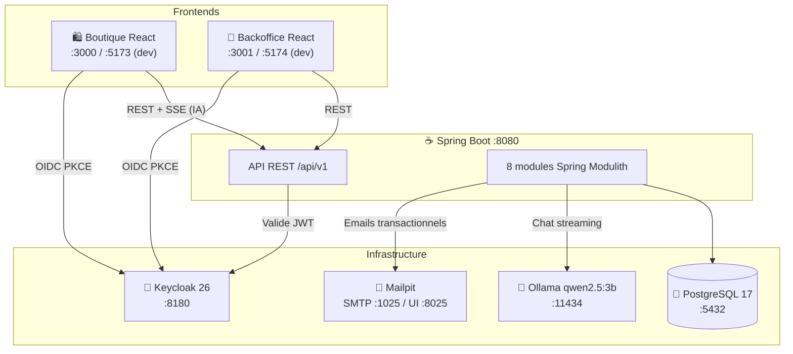

# 01 — Vue d'ensemble

## Présentation

**MacMarket** est une marketplace e-commerce spécialisée dans la vente de Mac (MacBook Air, MacBook Pro, iMac, Mac Mini, Mac Studio, Mac Pro). L'application est conçue comme un **monolithe modulaire** permettant une séparation claire des responsabilités tout en restant déployable comme un seul artefact.

## Utilisateurs et rôles

| Rôle | Description | Interface |
|------|-------------|-----------|
| **Visiteur** | Navigation et consultation du catalogue sans compte | Boutique |
| **Client** | Achat, panier, commandes, assistant IA | Boutique |
| **Manager** | Gestion des produits, commandes, inventaire | Backoffice |
| **Admin** | Toutes les fonctions manager + statistiques avancées | Backoffice |

## Architecture haute niveau

## Stack technologique globale

### Backend

| Composant | Technologie | Version |
|-----------|-------------|---------|
| Runtime | Java | 25 |
| Framework | Spring Boot | 4.1.0 |
| Architecture | Spring Modulith | 2.0.5 |
| IA | Spring AI + Ollama | 2.0.0 |
| ORM | Spring Data JPA / Hibernate | (Spring Boot) |
| Migration DB | Flyway | (Spring Boot) |
| Sécurité | Spring Security OAuth2 Resource Server | (Spring Boot) |
| PDF | Apache PDFBox | 3.0.4 |
| Cache | Caffeine | (Spring Boot) |
| Email | Spring Mail / Thymeleaf | (Spring Boot) |

### Frontend (×2)

| Composant | Technologie | Version |
|-----------|-------------|---------|
| Framework | React | 19.2 |
| Langage | TypeScript | 5.9 |
| Build | Vite | 7 |
| State serveur | TanStack Query | 5 |
| State client | Zustand | 5 (shop uniquement) |
| Auth | react-oidc-context / oidc-client-ts | 3.x |
| UI | shadcn/ui + Tailwind CSS | 4 |
| Tables | TanStack Table | 8 (admin uniquement) |
| Graphiques | Recharts | 3 |

### Infrastructure

| Service | Image | Version |
|---------|-------|---------|
| Base de données | postgres | 17-alpine |
| Auth | keycloak/keycloak | 26.6.0 |
| IA locale | ollama/ollama | latest |
| Email (dev) | axllent/mailpit | latest |

## Points d'entrée

| Service | URL locale | Description |
|---------|-----------|-------------|
| Boutique | http://localhost:3000 | Interface client |
| Backoffice | http://localhost:3001 | Interface administration |
| API | http://localhost:8080/api/v1 | REST API backend |
| Health | http://localhost:8080/actuator/health | Healthcheck Spring Actuator |
| Keycloak | http://localhost:8180 | Console d'administration IAM |
| Mailpit | http://localhost:8025 | Interface email de développement |
| Ollama | http://localhost:11434 | API modèle de langage |

## Classification DICP

| Composant | Disponibilité | Intégrité | Confidentialité | Preuve |
|-----------|:---:|:---:|:---:|:---:|
| Catalogue | 3 | 2 | 1 | 1 |
| Panier | 2 | 2 | 2 | 1 |
| Commandes | 3 | 4 | 3 | 3 |
| Paiement | 4 | 4 | 4 | 4 |
| Authentification (Keycloak) | 4 | 4 | 4 | 3 |
| Admin / Stats | 2 | 2 | 3 | 2 |
| Notification (email) | 1 | 2 | 2 | 2 |
| Assistant IA | 1 | 1 | 1 | 1 |

*Échelle : 1 (faible) → 4 (critique)*
