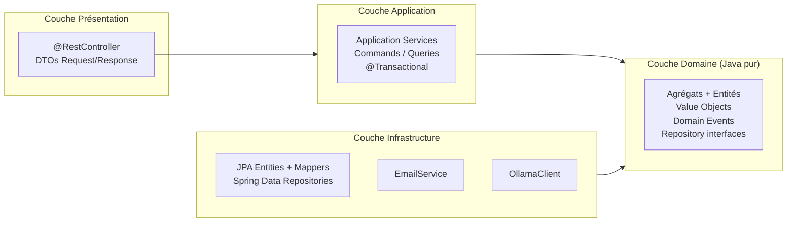
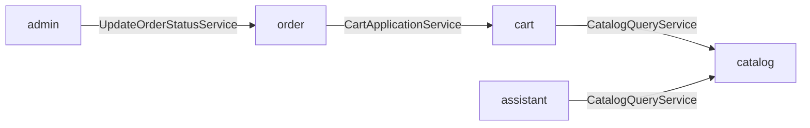
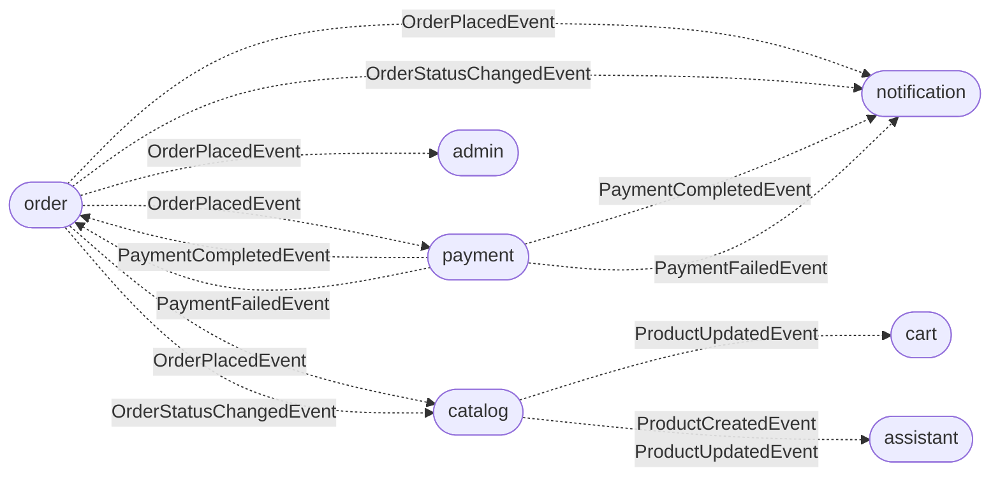
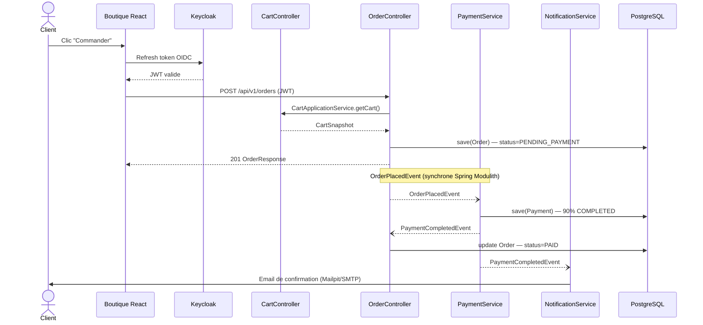

# 02 — Architecture

## Règle de dépendance

Le projet applique l'**architecture hexagonale (ports & adapters)** dans chaque module :

```
Presentation → Application → Domain ← Infrastructure
```

Le domaine est du Java pur, sans dépendance vers Spring, JPA ou tout autre framework.

## Couches applicatives



## Modules Spring Modulith

Le backend est organisé en **8 bounded contexts** autonomes. Chaque module dispose de sa propre structure en couches.

| Module | Responsabilité |
|--------|---------------|
| `catalog` | Catalogue produits Mac, gestion du stock, CRUD admin |
| `cart` | Panier utilisateur et invité, snapshots produits |
| `order` | Commandes, checkout, génération de factures PDF |
| `payment` | Paiement simulé (90% succès), gestion des statuts |
| `admin` | Backoffice : commandes, clients, dashboard, statistiques |
| `notification` | Envoi d'emails transactionnels via Thymeleaf + JavaMail |
| `assistant` | Chat IA avec historique (Ollama / qwen2.5:3b, SSE streaming) |
| `user` | Profils d'adresses de livraison |

## Dépendances directes inter-modules



## Communication par événements (Spring Modulith Events)



## Flux de traitement principal — Passage de commande



## Configuration des profils Spring

| Profil | Fichier | Usage |
|--------|---------|-------|
| *(défaut)* | `application.yml` | Développement local (localhost) |
| `dev` | `application-dev.yml` | Override développement |
| `docker` | `application-docker.yml` | Résolution DNS Docker interne (postgres, keycloak, ollama, mailpit) |

## Gestion de la publication d'événements

Spring Modulith utilise une table `event_publication` (V3__create_event_publication_table.sql) pour garantir la livraison at-least-once des événements de domaine. La configuration `jdbc-schema-initialization: enabled: false` indique que la table est créée manuellement via Flyway.
