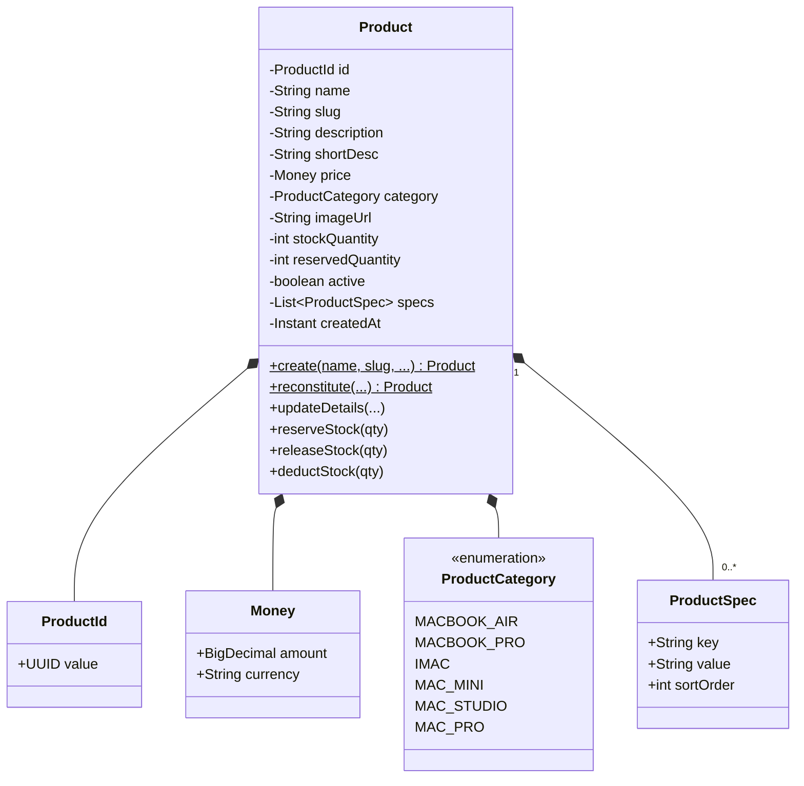
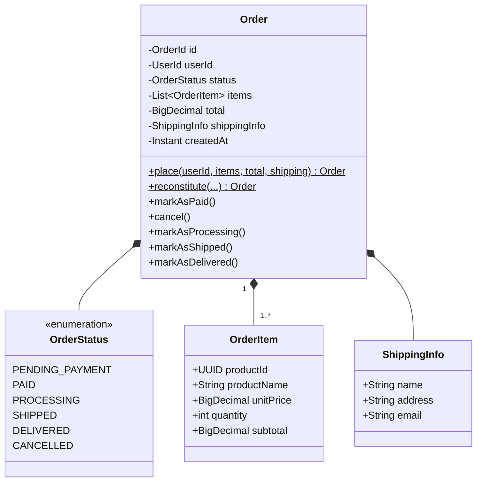
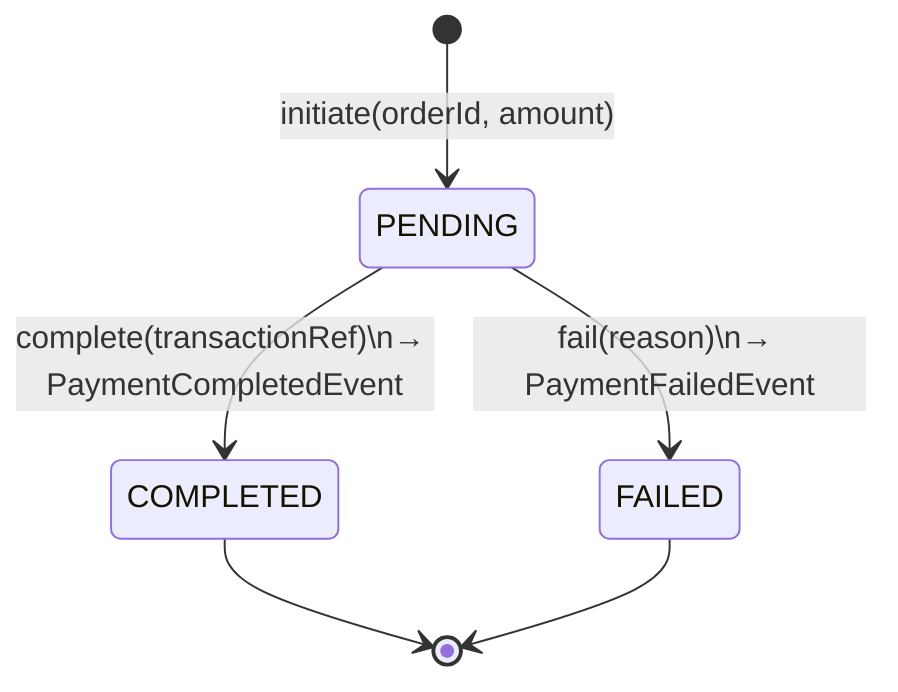
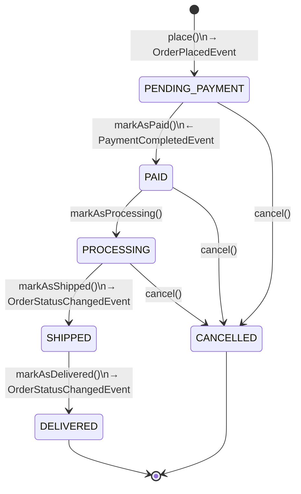
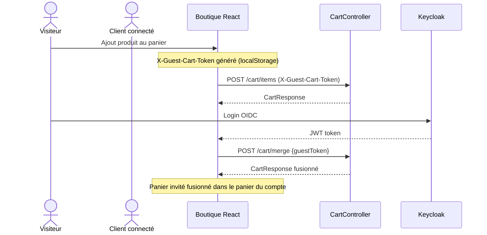
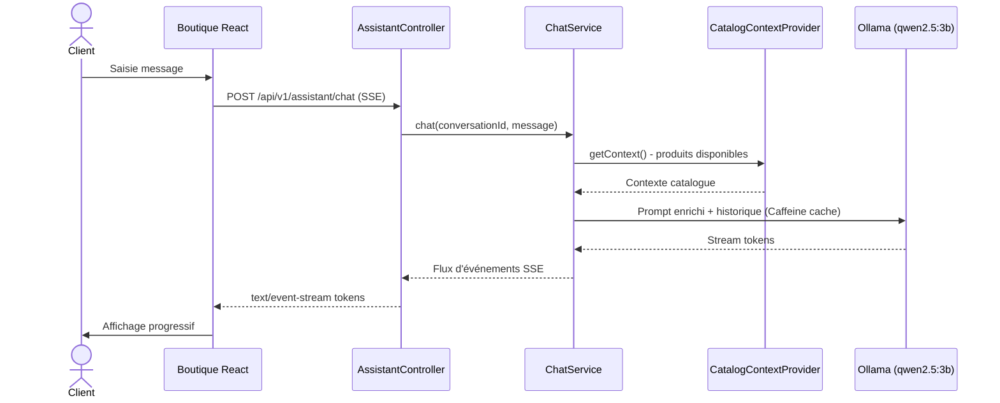

# 03 — Fonctionnel

## Cas d'usage — Boutique client

| Cas d'usage | Acteur | Endpoint | Auth requise |
|-------------|--------|----------|:---:|
| Consulter le catalogue | Visiteur / Client | `GET /api/v1/products` | Non |
| Filtrer par catégorie, prix, recherche | Visiteur / Client | `GET /api/v1/products?category=&search=&minPrice=&maxPrice=` | Non |
| Voir le détail d'un produit | Visiteur / Client | `GET /api/v1/products/{slug}` | Non |
| Lister les catégories | Visiteur / Client | `GET /api/v1/categories` | Non |
| Ajouter un article au panier | Visiteur / Client | `POST /api/v1/cart/items` | Non (guest token) |
| Modifier la quantité | Visiteur / Client | `PUT /api/v1/cart/items/{productId}` | Non (guest token) |
| Supprimer un article | Visiteur / Client | `DELETE /api/v1/cart/items/{productId}` | Non (guest token) |
| Vider le panier | Visiteur / Client | `DELETE /api/v1/cart` | Non (guest token) |
| Fusionner le panier invité | Client | `POST /api/v1/cart/merge` | Oui |
| Passer une commande | Client | `POST /api/v1/orders` | Oui |
| Consulter ses commandes | Client | `GET /api/v1/orders` | Oui |
| Télécharger une facture PDF | Client | `GET /api/v1/orders/{id}/invoice` | Oui |
| Discuter avec l'assistant IA | Client | `POST /api/v1/assistant/chat` (SSE) | Oui |
| Supprimer une conversation | Client | `DELETE /api/v1/assistant/conversations/{id}` | Oui |
| Gérer son profil de livraison | Client | `GET/POST/PUT/DELETE /api/v1/users/me/shipping-profiles` | Oui |

## Cas d'usage — Backoffice admin

| Cas d'usage | Rôle | Endpoint |
|-------------|------|----------|
| Voir le dashboard | Manager / Admin | `GET /api/v1/admin/dashboard` |
| Lister les commandes | Manager / Admin | `GET /api/v1/admin/orders` |
| Voir le détail d'une commande | Manager / Admin | `GET /api/v1/admin/orders/{id}` |
| Mettre à jour le statut d'une commande | Manager / Admin | `PUT /api/v1/admin/orders/{id}/status` |
| Lister les clients | Manager / Admin | `GET /api/v1/admin/customers` |
| Voir le détail d'un client | Manager / Admin | `GET /api/v1/admin/customers/{id}` |
| Créer un produit | Manager / Admin | `POST /api/v1/admin/products` |
| Modifier un produit | Manager / Admin | `PUT /api/v1/admin/products/{id}` |
| Supprimer un produit | Manager / Admin | `DELETE /api/v1/admin/products/{id}` |
| Statistiques revenue | Admin | `GET /api/v1/admin/stats/revenue?period=30d` |
| Statistiques produits | Admin | `GET /api/v1/admin/stats/products?period=30d` |
| Statistiques clients | Admin | `GET /api/v1/admin/stats/customers?period=30d` |
| Statistiques commandes | Admin | `GET /api/v1/admin/stats/orders?period=30d` |

## Entités métier principales

### Catalogue — `Product`

### Commande — `Order`

### Paiement — `Payment`

## Cycle de vie d'une commande

## Workflow du panier (visiteur → client)

## Flux de l'assistant IA

## Catégories de produits disponibles

| Enum | Libellé affiché |
|------|----------------|
| `MACBOOK_AIR` | MacBook Air |
| `MACBOOK_PRO` | MacBook Pro |
| `IMAC` | iMac |
| `MAC_MINI` | Mac Mini |
| `MAC_STUDIO` | Mac Studio |
| `MAC_PRO` | Mac Pro |
