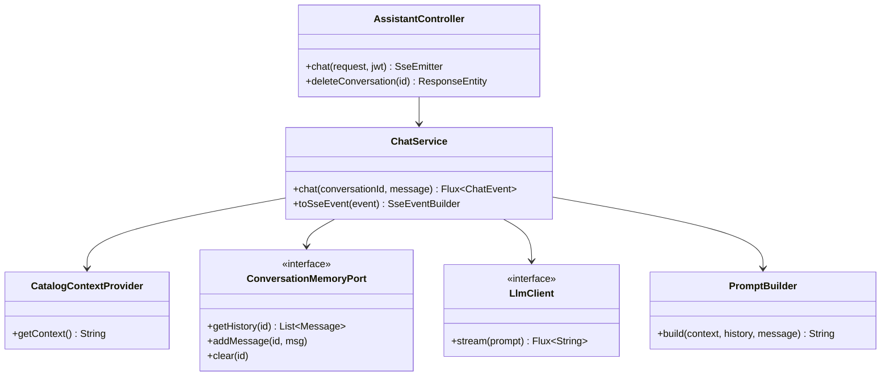

# 04 — Technique

## Stack backend détaillée

| Composant | Artefact Maven | Version |
|-----------|---------------|---------|
| JDK | eclipse-temurin | 25 |
| Spring Boot Parent | spring-boot-starter-parent | 4.1.0 |
| Spring Modulith BOM | spring-modulith-bom | 2.0.5 |
| Spring AI BOM | spring-ai-bom | 2.0.0 |
| Testcontainers BOM | testcontainers-bom | 1.20.6 |
| PostgreSQL JDBC | postgresql | (Spring Boot) |
| Flyway | flyway-database-postgresql | (Spring Boot) |
| PDFBox | pdfbox | 3.0.4 |
| Caffeine | caffeine | (Spring Boot) |

## Stack frontend détaillée

| Composant | Boutique | Backoffice |
|-----------|:---:|:---:|
| React | 19.2 | 19.2 |
| TypeScript | 5.9 | 5.9 |
| Vite | 7 | 7 |
| TanStack Query | 5 | 5 |
| TanStack Table | — | 8 |
| Zustand | 5 | — |
| react-oidc-context | 3 | 3 |
| shadcn/ui + Tailwind | 4 | 4 |
| Recharts | 3 | 3 |
| Sonner (toasts) | oui | — |
| Embla Carousel | oui | — |

## Endpoints REST complets

### Module `catalog`

| Méthode | Chemin | Rôle requis | Description |
|---------|--------|:-----------:|-------------|
| GET | `/api/v1/products` | Public | Liste paginée avec filtres |
| GET | `/api/v1/products/{slug}` | Public | Détail produit par slug |
| GET | `/api/v1/categories` | Public | Catégories avec comptage |
| POST | `/api/v1/admin/products` | MANAGER / ADMIN | Créer un produit |
| PUT | `/api/v1/admin/products/{id}` | MANAGER / ADMIN | Modifier un produit |
| DELETE | `/api/v1/admin/products/{id}` | MANAGER / ADMIN | Supprimer un produit |

### Module `cart`

| Méthode | Chemin | Rôle requis | Description |
|---------|--------|:-----------:|-------------|
| GET | `/api/v1/cart` | Public* | Récupérer le panier |
| POST | `/api/v1/cart/items` | Public* | Ajouter un article |
| PUT | `/api/v1/cart/items/{productId}` | Public* | Modifier la quantité |
| DELETE | `/api/v1/cart/items/{productId}` | Public* | Supprimer un article |
| DELETE | `/api/v1/cart` | Public* | Vider le panier |
| POST | `/api/v1/cart/merge` | Authentifié | Fusionner panier invité |

*Le panier invité s'identifie via le header `X-Guest-Cart-Token`.*

### Module `order`

| Méthode | Chemin | Rôle requis | Description |
|---------|--------|:-----------:|-------------|
| POST | `/api/v1/orders` | Authentifié | Passer une commande |
| GET | `/api/v1/orders` | Authentifié | Mes commandes |
| GET | `/api/v1/orders/{id}` | Authentifié | Détail commande |
| GET | `/api/v1/orders/{id}/invoice` | Authentifié | Télécharger facture PDF |

### Module `payment`

| Méthode | Chemin | Rôle requis | Description |
|---------|--------|:-----------:|-------------|
| GET | `/api/v1/payments/{orderId}` | Authentifié | Statut du paiement |

### Module `admin`

| Méthode | Chemin | Rôle requis | Description |
|---------|--------|:-----------:|-------------|
| GET | `/api/v1/admin/dashboard` | MANAGER / ADMIN | Dashboard général |
| GET | `/api/v1/admin/orders` | MANAGER / ADMIN | Commandes paginées + filtre statut |
| GET | `/api/v1/admin/orders/{id}` | MANAGER / ADMIN | Détail commande |
| PUT | `/api/v1/admin/orders/{id}/status` | MANAGER / ADMIN | Mettre à jour le statut |
| GET | `/api/v1/admin/customers` | MANAGER / ADMIN | Liste clients |
| GET | `/api/v1/admin/customers/{id}` | MANAGER / ADMIN | Détail client |
| GET | `/api/v1/admin/stats/{type}` | ADMIN | Statistiques (revenue/products/customers/orders) |

### Module `assistant`

| Méthode | Chemin | Rôle requis | Description |
|---------|--------|:-----------:|-------------|
| POST | `/api/v1/assistant/chat` | Authentifié | Chat SSE streaming |
| DELETE | `/api/v1/assistant/conversations/{id}` | Authentifié | Supprimer historique |

### Module `user`

| Méthode | Chemin | Rôle requis | Description |
|---------|--------|:-----------:|-------------|
| GET | `/api/v1/users/me/shipping-profiles` | Authentifié | Profils de livraison |
| POST | `/api/v1/users/me/shipping-profiles` | Authentifié | Créer un profil |
| PUT | `/api/v1/users/me/shipping-profiles/{id}` | Authentifié | Modifier un profil |
| DELETE | `/api/v1/users/me/shipping-profiles/{id}` | Authentifié | Supprimer un profil |

## Configuration

### Variables d'environnement

| Variable | Valeur par défaut | Description |
|----------|------------------|-------------|
| `DB_URL` | `jdbc:postgresql://localhost:5432/macmarket` | URL JDBC |
| `DB_USERNAME` | `macmarket` | Utilisateur PostgreSQL |
| `DB_PASSWORD` | *(vide)* | Mot de passe PostgreSQL |
| `SPRING_SECURITY_OAUTH2_RESOURCESERVER_JWT_ISSUER_URI` | `http://localhost:8180/realms/macmarket` | Issuer JWT Keycloak |
| `SPRING_AI_OLLAMA_BASE_URL` | `http://localhost:11434` | URL Ollama |
| `SPRING_MAIL_HOST` | `localhost` | Serveur SMTP |
| `SPRING_MAIL_PORT` | `1025` | Port SMTP |

### Configuration IA

```yaml
spring.ai.ollama:
  chat:
    model: qwen2.5:3b
    options:
      temperature: 0.7
      num-predict: 1024

macmarket.assistant.max-history: 20
```

L'historique des conversations est maintenu en mémoire via **Caffeine cache**. Chaque conversation est identifiée par un `conversationId` UUID.

## Architecture technique du module assistant



## Observabilité

| Composant | Configuration |
|-----------|--------------|
| Spring Actuator | `management.endpoints.web.exposure.include: health` |
| Healthcheck Docker | `wget -qO- http://localhost:8080/actuator/health` |
| Logging | SLF4J (logback par défaut Spring Boot) |

> **Limitation** : Seul l'endpoint `/actuator/health` est exposé. Aucune configuration de métriques (Micrometer/Prometheus) ni de tracing distribué (Zipkin/OTLP) n'a été détectée.
