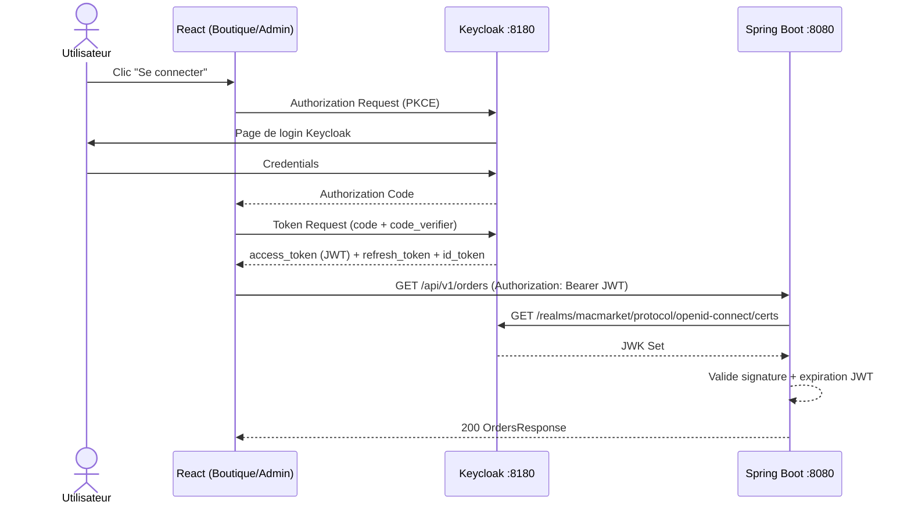
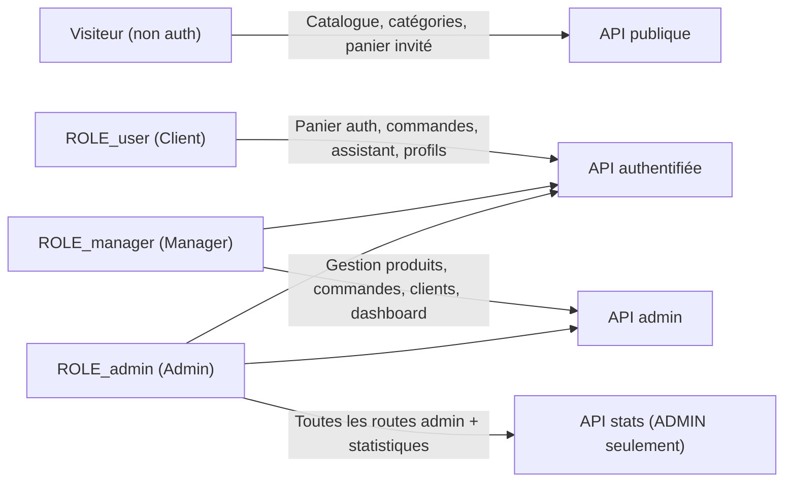

# 05 — Sécurité

## Mécanisme d'authentification

MacMarket utilise **Keycloak 26** comme Identity Provider, avec le protocole **OAuth2/OIDC PKCE** pour les frontends et **JWT Bearer Token** pour l'API REST.



## Configuration Spring Security

```java
// SecurityConfig.java — règles d'accès
.authorizeHttpRequests(auth -> auth
    .requestMatchers("/api/v1/products/**", "/api/v1/categories/**").permitAll()
    .requestMatchers("/api/v1/admin/stats/**").hasRole("ADMIN")
    .requestMatchers("/api/v1/admin/**").hasAnyRole("MANAGER", "ADMIN")
    .requestMatchers(HttpMethod.POST, "/api/v1/cart/merge").authenticated()
    .requestMatchers("/api/v1/cart/**").permitAll()
    .requestMatchers("/api/v1/**").authenticated()
    .requestMatchers("/actuator/health").permitAll()
)
```

Les rôles sont extraits du claim `realm_access.roles` du JWT Keycloak et convertis en `ROLE_XXX` Spring Security.

## Modèle RBAC



| Route | Visiteur | Client | Manager | Admin |
|-------|:---:|:---:|:---:|:---:|
| `GET /api/v1/products` | ✅ | ✅ | ✅ | ✅ |
| `GET /api/v1/cart` | ✅ (guest) | ✅ | ✅ | ✅ |
| `POST /api/v1/cart/merge` | ❌ | ✅ | ✅ | ✅ |
| `POST /api/v1/orders` | ❌ | ✅ | ✅ | ✅ |
| `POST /api/v1/assistant/chat` | ❌ | ✅ | ✅ | ✅ |
| `GET /api/v1/admin/orders` | ❌ | ❌ | ✅ | ✅ |
| `POST /api/v1/admin/products` | ❌ | ❌ | ✅ | ✅ |
| `GET /api/v1/admin/stats/*` | ❌ | ❌ | ❌ | ✅ |

## Gestion des secrets

| Secret | Mécanisme | Notes |
|--------|-----------|-------|
| Mot de passe PostgreSQL | Variable d'environnement `DB_PASSWORD` | Défini dans `.env` (gitignore) |
| Admin Keycloak | `KC_BOOTSTRAP_ADMIN_PASSWORD` | Variable d'environnement |
| JWT signé par Keycloak | RS256 — clé privée Keycloak | Validation via JWK URI |
| Token invité panier | UUID généré côté client | Stocké dans `localStorage` |

> `.env` est exclu du dépôt (`.env.template` fourni). Ne jamais commiter de secrets.

## Panier invité — gestion du token

Le panier sans authentification utilise un token guest opaque (`X-Guest-Cart-Token`) :
- Généré côté React dans `localStorage`
- Envoyé en header HTTP sur toutes les requêtes cart non authentifiées
- Fusionné dans le panier du compte lors de la connexion via `POST /api/v1/cart/merge`

## Analyse OWASP Top 10

| Risque | Statut | Détail |
|--------|:---:|--------|
| A01 — Contrôle d'accès défaillant | ✅ | `@EnableMethodSecurity`, règles Spring Security par rôle |
| A02 — Echecs cryptographiques | ✅ | JWT RS256 signé par Keycloak, pas de données sensibles en clair |
| A03 — Injection | ✅ | Spring Data JPA (requêtes paramétrées), Bean Validation sur les DTOs |
| A04 — Conception non sécurisée | ✅ | DDD, séparation domaine/infrastructure, invariants dans les agrégats |
| A05 — Mauvaise configuration sécurité | ⚠️ | Session stateless OK, CSRF désactivé (API REST — attendu) |
| A06 — Composants vulnérables | ⚠️ | Aucun scan CVE automatisé détecté dans le pipeline |
| A07 — Échecs d'authentification | ✅ | Délégué à Keycloak (brute-force protection, MFA disponible) |
| A08 — Intégrité données et logiciel | ✅ | Flyway pour les migrations, Docker digest non fixé (⚠️ `latest`) |
| A09 — Journalisation insuffisante | ⚠️ | SLF4J présent, mais pas de configuration d'audit explicite |
| A10 — SSRF | ✅ | Pas de proxy ou de résolution d'URL externe contrôlée par l'utilisateur |

## Points d'attention sécurité

1. **Image Docker `ollama/ollama:latest`** — utiliser un digest fixé en production pour éviter les régressions
2. **Audit log** — aucun mécanisme d'audit trail explicite détecté pour les actions sensibles (annulation commande, suppression produit)
3. **Scan CVE** — intégrer OWASP Dependency-Check ou Trivy dans le pipeline CI
4. **CORS** — non visible dans `SecurityConfig.java` ; vérifier la configuration `CorsConfig.java`
5. **Rate limiting** — aucun rate limiting détecté sur l'API REST (notamment `POST /assistant/chat`)
