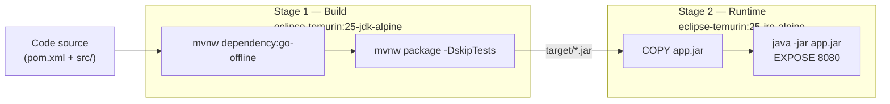
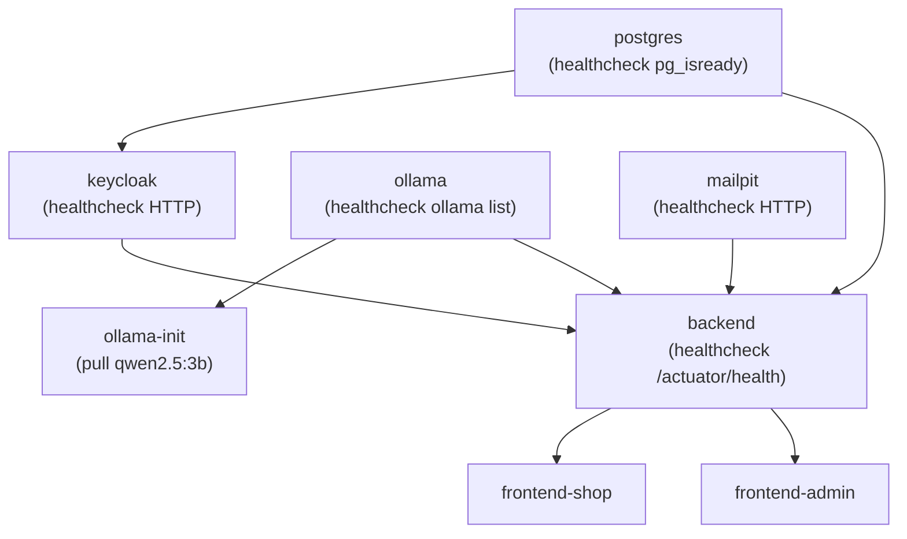

# 06 — Packaging

## Artefacts générés

| Artefact | Type | Description |
|----------|------|-------------|
| `macmarket-backend-0.0.1-SNAPSHOT.jar` | Fat JAR Spring Boot | Backend exécutable |
| Image Docker `macmarket-backend` | OCI Image | Backend conteneurisé |
| Image Docker `macmarket-frontend-shop` | OCI Image | Boutique (Nginx) |
| Image Docker `macmarket-frontend-admin` | OCI Image | Backoffice (Nginx) |

## Dockerfile Backend — Build multi-stage



**Optimisations détectées :**
- Séparation des dépendances (`dependency:go-offline`) et du code source pour profiter du cache Docker
- Image runtime JRE uniquement (pas JDK) — image finale plus légère
- `settings.xml` vide (`<settings/>`) pour éviter toute dépendance vers un registry Maven externe non disponible

## Dockerfile Frontends — Build multi-stage

Les frontends (`frontend-shop` et `frontend-admin`) utilisent un pattern similaire :
- **Stage build** : Node.js, `npm ci`, `npm run build`
- **Stage runtime** : Nginx Alpine servant les fichiers statiques
- **Configuration Nginx** : `nginx.conf` à la racine de chaque frontend

## Services Docker Compose

| Service | Image | Port(s) | Healthcheck |
|---------|-------|---------|-------------|
| `postgres` | postgres:17-alpine | 5432 | `pg_isready` |
| `keycloak` | keycloak/keycloak:26.6.0 | `${KEYCLOAK_HTTP_PORT}` | HTTP /health/ready |
| `ollama` | ollama/ollama:latest | 11434 | `ollama list` |
| `ollama-init` | ollama/ollama:latest | — | one-shot (pull modèle) |
| `mailpit` | axllent/mailpit:latest | `${MAILPIT_SMTP_PORT}`, `${MAILPIT_UI_PORT}` | GET /api/v1/info |
| `backend` | build local | `${BACKEND_PORT}` | GET /actuator/health |
| `frontend-shop` | build local | `${FRONTEND_SHOP_PORT}` | GET / |
| `frontend-admin` | build local | `${FRONTEND_ADMIN_PORT}` | GET / |

## Ordre de démarrage (depends_on + healthcheck)



## Variables d'environnement `.env`

| Variable | Valeur par défaut | Service |
|----------|------------------|---------|
| `POSTGRES_DB` | `macmarket` | postgres |
| `POSTGRES_USER` | `macmarket` | postgres |
| `POSTGRES_PASSWORD` | *(à définir)* | postgres |
| `KEYCLOAK_ADMIN_PASSWORD` | *(à définir)* | keycloak |
| `KEYCLOAK_HTTP_PORT` | `8180` | keycloak |
| `OLLAMA_MODEL` | `qwen2.5:3b` | ollama-init |
| `MAILPIT_SMTP_PORT` | `1025` | mailpit |
| `MAILPIT_UI_PORT` | `8025` | mailpit |
| `BACKEND_PORT` | `8080` | backend |
| `FRONTEND_SHOP_PORT` | `3000` | frontend-shop |
| `FRONTEND_ADMIN_PORT` | `3001` | frontend-admin |
| `NPM_REGISTRY_URL` | *(optionnel)* | frontends |
| `NPM_REGISTRY_HOST` | *(optionnel)* | frontends |

> Le fichier `.env` est créé depuis `.env.template` via `make init`. Il ne doit jamais être commité.

## Volumes persistants

| Volume Docker | Contenu |
|--------------|---------|
| `postgres_data` | Données PostgreSQL |
| `./data/ollama:/root/.ollama` | Modèles Ollama (bind mount) |
| `./data/invoices` | Factures PDF générées |

## Démarrage rapide

```bash
# Initialiser (crée .env depuis .env.template)
make init

# Lancer toute la stack
make up

# Voir les logs
make logs

# Arrêter
make down
```
