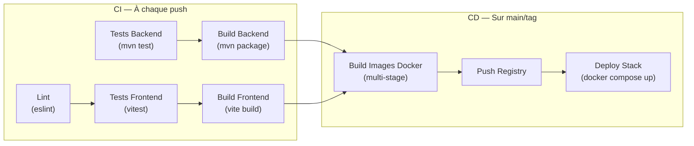

# 07 — CI/CD

## Tests automatisés

### Backend — Tests disponibles

| Type | Technologie | Localisation |
|------|-------------|-------------|
| Tests unitaires domaine | JUnit 5 | `src/test/java/com/macmarket/*/` |
| Tests modulaires Spring Modulith | `ApplicationModules.verify()` | `MacMarketModularityTests.java` |
| Tests d'intégration | Spring Boot Test + Testcontainers (PostgreSQL) | `TestcontainersConfiguration.java` |
| Tests sécurité | `spring-security-test` | Disponible |

#### Test de modularité Spring Modulith

```java
// MacMarketModularityTests.java
class MacMarketModularityTests {
    ApplicationModules modules = ApplicationModules.of(MacMarketApplication.class);

    @Test
    void verifyModuleStructure() {
        modules.verify(); // Vérifie les dépendances inter-modules
    }
}
```

Ce test garantit qu'aucun module ne viole les règles de dépendances définies. Il échoue si un module accède directement aux internals d'un autre module.

### Frontend — Tests disponibles

| Type | Technologie | Localisation |
|------|-------------|-------------|
| Tests unitaires composants | Vitest + Testing Library | `src/**/*.test.ts(x)` |
| Tests de store | Vitest | `cart-store.test.ts` |
| Tests de pages | Vitest + Testing Library | `CustomerDetailPage.test.tsx`, `CustomersPage.test.tsx` |
| Tests lib | Vitest | `api.test.ts` |

### Commandes de test

```bash
# Backend — tous les tests
cd backend && ./mvnw test

# Backend — tests modularity uniquement
cd backend && ./mvnw test -Dtest=MacMarketModularityTests

# Frontend boutique
cd frontend-shop && npm test

# Frontend admin
cd frontend-admin && npm test

# Via Makefile
make test           # tous les tests
make test-modularity # Spring Modulith uniquement
make test-frontend  # frontends
```

## Pipeline CI/CD

> **Hypothèse** : Aucun fichier `.github/workflows/` ou `.gitlab-ci.yml` n'a été détecté dans le projet. La section suivante décrit le pipeline recommandé basé sur la structure du projet.

### Pipeline recommandé



## Qualité du code

### Backend

| Outil | Status |
|-------|:---:|
| Tests unitaires | Présents |
| Tests modulaires (Spring Modulith) | Présents |
| Tests d'intégration (Testcontainers) | Infrastructure disponible |
| Scan CVE (OWASP Dependency-Check) | ⚠️ Non détecté |
| Analyse statique (SonarQube) | ⚠️ Non détecté |
| Coverage (JaCoCo) | ⚠️ Non configuré dans pom.xml |

### Frontend

| Outil | Status |
|-------|:---:|
| ESLint | Configuré (`eslint.config.js`) |
| TypeScript strict | `tsconfig.json` — à vérifier |
| Tests Vitest | Présents |
| Coverage | ⚠️ Non configuré explicitement |

## Makefile — Commandes disponibles

| Cible | Description |
|-------|-------------|
| `make help` | Afficher l'aide |
| `make init` | Créer `.env` et dossiers `data/` |
| `make up` | Lancer toute la stack (7 services) |
| `make down` | Arrêter la stack |
| `make restart` | Redémarrer |
| `make logs` | Voir les logs |
| `make status` | Statut des services |
| `make urls` | Lister toutes les URLs |
| `make dev` | Mode développement (infra seulement) |
| `make build` | Construire toutes les images Docker |
| `make test` | Lancer tous les tests |
| `make test-modularity` | Tests Spring Modulith |
| `make test-frontend` | Tests frontends |
| `make db-reset` | Réinitialiser la base de données |
| `make db-shell` | Ouvrir un shell PostgreSQL |
| `make ollama-status` | Statut Ollama |
| `make ollama-pull` | Télécharger le modèle IA |
| `make clean` | Nettoyer les conteneurs |
| `make reset` | Réinitialisation complète |

## Workflow de développement local

```bash
# 1. Initialiser
make init

# 2. Lancer l'infrastructure uniquement (postgres, keycloak, ollama, mailpit)
make dev

# 3. Démarrer le backend en local
cd backend && ./mvnw spring-boot:run

# 4. Démarrer les frontends en local
cd frontend-shop && npm run dev    # :5173
cd frontend-admin && npm run dev   # :5174
```
