# 07 — CI/CD

## Tests automatisés

### Backend — Tests disponibles

| Type | Technologie | Localisation |
|------|-------------|-------------|
| Tests unitaires domaine | JUnit 5 | `src/test/java/com/macmarket/*/` |
| Tests modulaires Spring Modulith | `ApplicationModules.verify()` | `MacMarketModularityTests.java` |
| Tests d'intégration | Spring Boot Test + Testcontainers (PostgreSQL) | `TestcontainersConfiguration.java` |
| Tests sécurité | `spring-security-test` | Disponible |

#### Test de modularité Spring Modulith

```java
// MacMarketModularityTests.java
class MacMarketModularityTests {
    ApplicationModules modules = ApplicationModules.of(MacMarketApplication.class);

    @Test
    void verifyModuleStructure() {
        modules.verify(); // Vérifie les dépendances inter-modules
    }
}
```

Ce test garantit qu'aucun module ne viole les règles de dépendances définies. Il échoue si un module accède directement aux internals d'un autre module.

### Frontend — Tests disponibles

| Type | Technologie | Localisation |
|------|-------------|-------------|
| Tests unitaires composants/services | Vitest (builder `@angular/build:unit-test`) | `src/app/**/*.spec.ts` |
| Vérification de types | `tsc --noEmit` | Étape CI dédiée (voir pipeline ci-dessous) |

> Les frontends sont passés de Vitest + Testing Library sur React (`*.test.tsx`) à Vitest intégré au builder Angular (`*.spec.ts`) lors de la migration vers Angular (ADR-0006).

### Commandes de test

```bash
# Backend — tous les tests
cd backend && ./mvnw test

# Backend — tests modularity uniquement
cd backend && ./mvnw test -Dtest=MacMarketModularityTests

# Frontend boutique
cd frontend-shop && npm test

# Frontend admin
cd frontend-admin && npm test

# Via Makefile
make test           # tous les tests backend
make test-modularity # Spring Modulith uniquement
make test-frontend  # tests des deux frontends (Vitest)
```

## Pipeline CI/CD

Un pipeline GitHub Actions est défini dans [`.github/workflows/ci.yml`](../.github/workflows/ci.yml), déclenché sur `push` et `pull_request` vers `main`/`develop`. Il comprend 3 jobs indépendants exécutés en parallèle :

```mermaid
graph LR
    subgraph CI["CI — push / pull_request (main, develop)"]
        subgraph Backend["Job backend"]
            B1["Setup Java 25"]
            B2["mvn compile"]
            B3["mvn verify\n(tests unitaires + intégration)"]
            B4["Upload rapport surefire"]
        end
        subgraph FA["Job frontend-admin"]
            FA1["Setup Node 22"]
            FA2["npm ci"]
            FA3["tsc --noEmit"]
            FA4["npm test -- --run"]
            FA5["ng build --configuration production"]
        end
        subgraph FS["Job frontend-shop"]
            FS1["Setup Node 22"]
            FS2["npm ci"]
            FS3["tsc --noEmit"]
            FS4["npm test -- --run"]
            FS5["ng build --configuration production"]
        end
    end

    B1 --> B2 --> B3 --> B4
    FA1 --> FA2 --> FA3 --> FA4 --> FA5
    FS1 --> FS2 --> FS3 --> FS4 --> FS5
```



> **Limitation actuelle** : le pipeline couvre build + tests + vérification de types, mais ne construit pas les images Docker et n'exécute aucun déploiement (pas de job CD). Il n'y a pas non plus d'étape de lint (ESLint) explicite dans `ci.yml`, ni de scan de vulnérabilités.

## Qualité du code

### Backend

| Outil | Status |
|-------|:---:|
| Tests unitaires | Présents (CI : job `backend`) |
| Tests modulaires (Spring Modulith) | Présents |
| Tests d'intégration (Testcontainers) | Infrastructure disponible, exécutée via `mvn verify` en CI |
| Scan CVE (OWASP Dependency-Check) | ⚠️ Non détecté |
| Analyse statique (SonarQube) | ⚠️ Non détecté |
| Coverage (JaCoCo) | ⚠️ Non configuré dans pom.xml |

### Frontend

| Outil | Status |
|-------|:---:|
| ESLint | ⚠️ Non exécuté en CI (pas d'étape lint dans `ci.yml`) |
| TypeScript strict | `tsconfig.json` — `strict: true` activé, vérifié en CI (`tsc --noEmit`) |
| Tests Vitest | Présents (CI : jobs `frontend-admin` / `frontend-shop`) |
| Coverage | ⚠️ Non configuré explicitement |

## Makefile — Commandes disponibles

| Cible | Description |
|-------|-------------|
| `make help` | Afficher l'aide |
| `make init` | Créer `.env` et dossiers `data/` |
| `make first-time` | Premier lancement : régénère les lockfiles npm + stack + modèle LLM |
| `make up` | Lancer toute la stack (7 services) |
| `make down` | Arrêter la stack |
| `make restart` | Redémarrer |
| `make logs` | Voir les logs |
| `make status` | Statut des services |
| `make urls` | Lister toutes les URLs disponibles |
| `make dev` | Mode développement (infra seulement) |
| `make dev-down` | Arrêter l'infra dev |
| `make backend-run` | Lancer le backend en local (hot-reload) |
| `make shop-run` | Lancer le frontend boutique en local (hot-reload) |
| `make admin-run` | Lancer le frontend backoffice en local (hot-reload) |
| `make build` | Construire toutes les images Docker |
| `make build-no-cache` | Reconstruire toutes les images Docker sans cache |
| `make build-backend` / `build-shop` / `build-admin` | Construire une image Docker spécifique |
| `make test` | Lancer les tests backend (Testcontainers) |
| `make test-modularity` | Tests Spring Modulith |
| `make test-frontend` | Tests des deux frontends (Vitest) |
| `make npm-lockfiles` | Régénérer les `package-lock.json` (dépend du registre npm du poste) |
| `make db-reset` | Réinitialiser la base de données |
| `make db-shell` | Ouvrir un shell PostgreSQL |
| `make ollama-ensure` | Télécharger le modèle LLM configuré s'il est absent |
| `make ollama-status` | Statut Ollama |
| `make ollama-logs` | Logs du pull initial du modèle |
| `make ollama-pull` | Re-télécharger le modèle LLM |
| `make clean` | Nettoyer les conteneurs |
| `make reset` | Réinitialisation complète |

## Workflow de développement local

```bash
# 1. Initialiser
make init

# 2. Lancer l'infrastructure uniquement (postgres, keycloak, ollama, mailpit)
make dev

# 3. Démarrer le backend en local
cd backend && ./mvnw spring-boot:run

# 4. Démarrer les frontends en local
cd frontend-shop && npm run dev    # :5173
cd frontend-admin && npm run dev   # :5174
```
