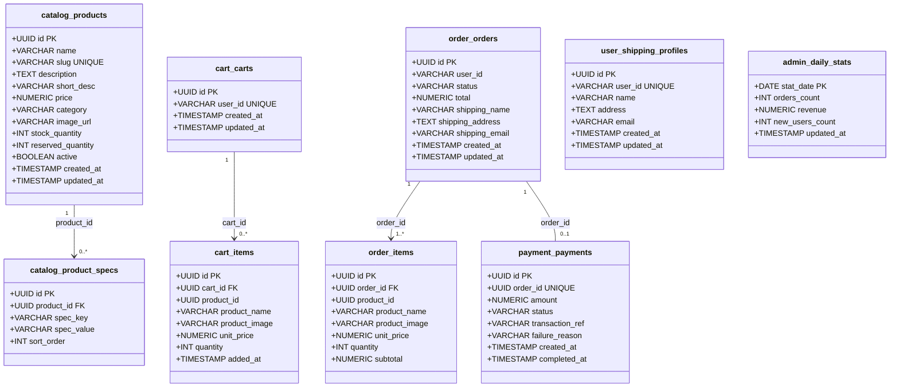
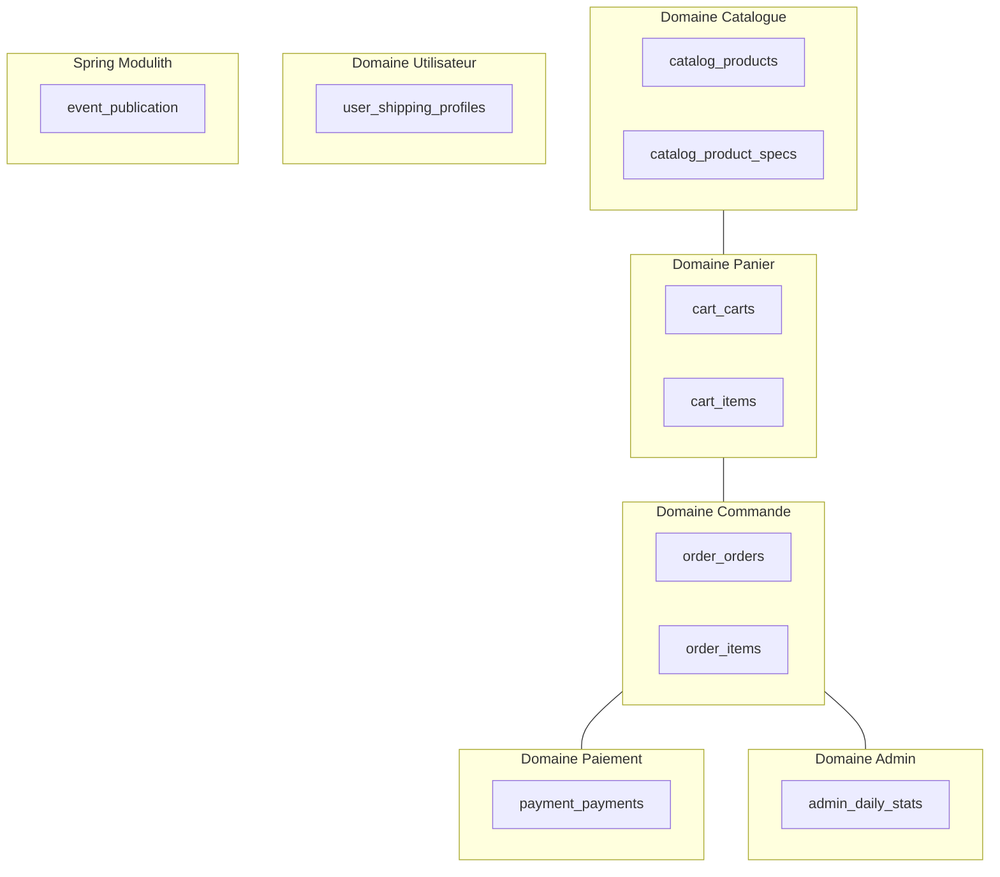

# 08 — Modèle de données

## Contexte

- **Engine** : PostgreSQL 17
- **Schema** : public (application) + keycloak (schema dédié Keycloak)
- **DDL Auto** : `none` — les migrations sont gérées exclusivement par Flyway
- **Migrations** : `classpath:db/migration/V*.sql`

## Migrations Flyway

| Version | Fichier | Contenu |
|---------|---------|---------|
| V1 | `V1__create_catalog_tables.sql` | `catalog_products`, `catalog_product_specs` |
| V2 | `V2__create_cart_tables.sql` | `cart_carts`, `cart_items` |
| V3 | `V3__create_event_publication_table.sql` | Table Spring Modulith event publication |
| V4 | `V4__create_order_tables.sql` | `order_orders`, `order_items` |
| V5 | `V5__create_payment_table.sql` | `payment_payments` |
| V6 | `V6__seed_products.sql` | Données initiales — catalogue Mac |
| V7 | `V7__create_admin_daily_stats.sql` | `admin_daily_stats` |
| V8 | `V8__create_user_shipping_profiles_table.sql` | `user_shipping_profiles` |

## Schéma logique

## Carte des domaines de données

## Index et contraintes

| Table | Index |
|-------|-------|
| `catalog_products` | `slug` (unique), `category`, `active` |
| `catalog_product_specs` | `product_id`, `(product_id, spec_key)` (unique) |
| `cart_carts` | `user_id` (unique) |
| `cart_items` | `cart_id`, `(cart_id, product_id)` (unique) |
| `order_orders` | `user_id`, `status`, `created_at` |
| `order_items` | `order_id` |
| `payment_payments` | `order_id` (unique), `status` |
| `user_shipping_profiles` | `user_id` (unique) |

## Conventions de nommage des tables

Les tables sont préfixées par leur module applicatif pour éviter les conflits et refléter l'appartenance au bounded context :

| Préfixe | Module |
|---------|--------|
| `catalog_` | catalog |
| `cart_` | cart |
| `order_` | order |
| `payment_` | payment |
| `user_` | user |
| `admin_` | admin |

## Identifiants

Tous les identifiants primaires sont des **UUID** (`gen_random_uuid()` PostgreSQL), sans séquence auto-incrémentée. Cela garantit la portabilité et l'absence de collisions lors d'éventuelles fusions de données.

## Snapshot des produits dans le panier et les commandes

Les tables `cart_items` et `order_items` stockent une **copie dénormalisée** des données produit (`product_name`, `product_image`, `unit_price`). Cela garantit que le panier et les commandes sont immuables par rapport aux modifications ultérieures du catalogue.
