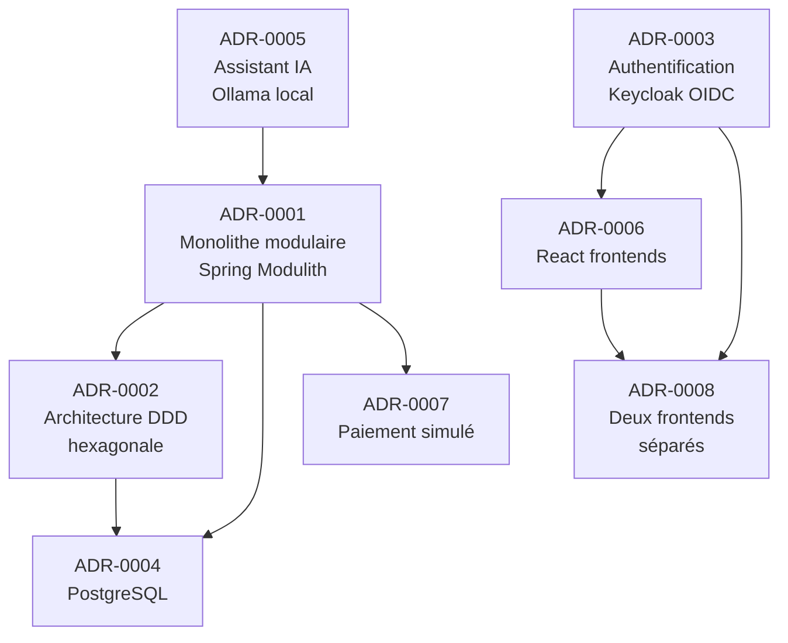

# Architecture Decision Records — MacMarket

Ce répertoire contient les ADRs (Architecture Decision Records) du projet MacMarket, au format MADR.

## Liste des décisions

| ADR | Titre | Statut |
|-----|-------|--------|
| [ADR-0001](ADR-0001-monolithe-modulaire-spring-modulith.md) | Monolithe modulaire avec Spring Modulith | Accepté |
| [ADR-0002](ADR-0002-architecture-ddd-hexagonale.md) | Architecture DDD hexagonale (ports & adapters) | Accepté |
| [ADR-0003](ADR-0003-authentification-keycloak-oidc.md) | Authentification avec Keycloak OAuth2/OIDC | Accepté |
| [ADR-0004](ADR-0004-postgresql-base-de-donnees.md) | PostgreSQL comme base de données principale | Accepté |
| [ADR-0005](ADR-0005-assistant-ia-ollama-local.md) | Assistant IA avec Ollama et modèle local (qwen2.5:3b) | Accepté |
| [ADR-0006](ADR-0006-react-frontends.md) | React pour les frontends | Accepté |
| [ADR-0007](ADR-0007-paiement-simule.md) | Paiement simulé | Accepté |
| [ADR-0008](ADR-0008-deux-frontends-separes.md) | Deux frontends React séparés (boutique et backoffice) | Accepté |

## Conventions

- Format : [MADR](https://adr.github.io/madr/)
- Langue : français
- Nommage : `ADR-NNNN-titre-en-kebab-case.md`
- Statuts possibles : `Proposé` | `Accepté` | `Déprécié` | `Remplacé par ADR-NNNN`

## Relations entre ADRs

