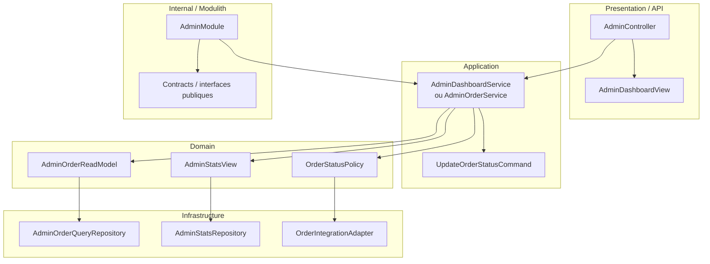

# Domaine Admin

## Vue synthétique DDD + Modulith

Ce domaine s’organise davantage autour de vues de lecture et de pilotage que d’un agrégat classique. L’objectif est de rendre l’administration observable tout en restant aligné avec la logique DDD et la modularité du système.

## Lecture du schéma

- La couche Presentation expose les écrans et endpoints d’administration.
- La couche Application orchestre les opérations de consultation et de pilotage.
- La couche Domain repose sur des read models et des règles de supervision plutôt que sur un agrégat de transaction classique.
- La couche Infrastructure alimente ces vues à partir des sources de données et des intégrations existantes.
- Le cadre Internal / Modulith matérialise la frontière du module Admin.

## Règle de dépendance essentielle

Le module Admin reste orienté par le besoin de lecture et de supervision :

Presentation → Application → Domain ← Infrastructure

Cette organisation évite de mélanger logique métier transactionnelle et logique de pilotage.
