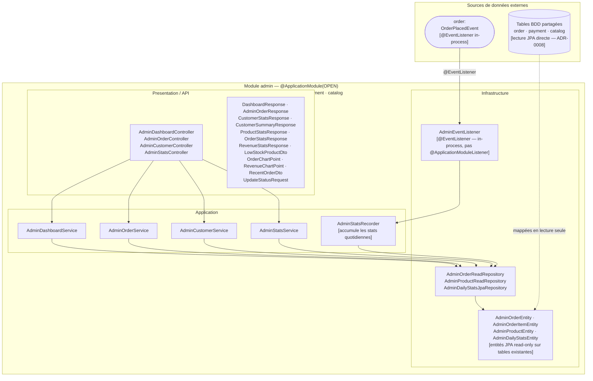

# Domaine Admin

## Vue synthétique DDD + Modulith

Le module Admin est un **module de lecture seule (CQRS read side)**. Il n'a pas de couche Domain propre ni d'agrégat transactionnel — il exploite des entités JPA en lecture directe sur les tables des autres modules (cf. ADR-0008). Son rôle est de fournir des vues agrégées pour le tableau de bord, les statistiques et la supervision des commandes.



## Concepts DDD dans ce module

| Concept | Présent | Note |
|---|---|---|
| Aggregate Root | Non | Module CQRS read-side : pas de logique transactionnelle |
| Domain Events publiés | Non | Le module n'émet aucun événement |
| Domain Events consommés | `OrderPlacedEvent` | Via `@EventListener` (synchrone in-process, non transactionnel comme `@ApplicationModuleListener`) |
| Read Models | `AdminOrderEntity`, `AdminProductEntity`, etc. | Entités JPA mappées directement sur les tables des autres modules (ADR-0008) |
| Repository | `AdminOrderReadRepository`, `AdminProductReadRepository`, `AdminDailyStatsJpaRepository` | En lecture seule, pas de port domain |

## Contraintes Modulith

- **Type** : `OPEN`
- **allowedDependencies** : `order`, `payment`, `catalog` — autorise la lecture de leurs tables JPA
- `AdminEventListener` utilise `@EventListener` (Spring standard) et non `@ApplicationModuleListener` — le traitement est synchrone et dans la même transaction que l'émetteur
- Les entités JPA Admin (`AdminOrderEntity`, etc.) mappent directement les tables d'autres modules : aucune couche de traduction, mais fort couplage structurel aux schémas (ADR-0008)

## Particularité architecturale

Ce module ne suit pas le pattern DDD classique. La couche Domain est absente intentionnellement : le module Admin est un observateur des données produites par d'autres domaines, sans responsabilité métier propre.

```
Presentation → Application → Infrastructure ← (données order · payment · catalog)
```
