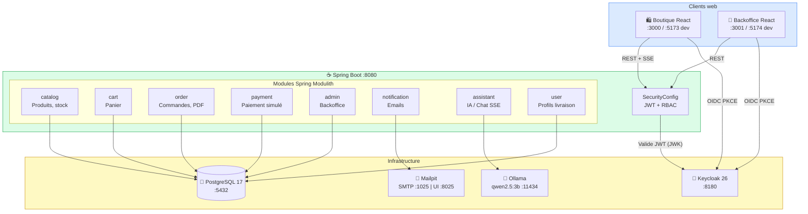

# Architecture globale — MacMarket

Vue d'ensemble de tous les services et leurs connexions.

```mermaid
graph TB
    subgraph Clients["Clients web"]
        SHOP["🛍️ Boutique React\n:3000 / :5173 dev"]
        ADMIN["🔧 Backoffice React\n:3001 / :5174 dev"]
    end

    subgraph Backend["☕ Spring Boot :8080"]
        SEC["SecurityConfig\nJWT + RBAC"]
        subgraph Modules["Modules Spring Modulith"]
            CAT["catalog\nProduits, stock"]
            CART["cart\nPanier"]
            ORD["order\nCommandes, PDF"]
            PAY["payment\nPaiement simulé"]
            ADM["admin\nBackoffice"]
            NOTIF["notification\nEmails"]
            ASST["assistant\nIA / Chat SSE"]
            USR["user\nProfils livraison"]
        end
    end

    subgraph Infra["Infrastructure"]
        PG[("🐘 PostgreSQL 17\n:5432")]
        KC["🔑 Keycloak 26\n:8180"]
        OLL["🤖 Ollama\nqwen2.5:3b :11434"]
        MAIL["📧 Mailpit\nSMTP :1025 | UI :8025"]
    end

    SHOP -- "REST + SSE" --> SEC
    ADMIN -- "REST" --> SEC
    SHOP -- "OIDC PKCE" --> KC
    ADMIN -- "OIDC PKCE" --> KC
    SEC -- "Valide JWT (JWK)" --> KC

    CAT --> PG
    CART --> PG
    ORD --> PG
    PAY --> PG
    ADM --> PG
    USR --> PG
    ASST --> OLL
    NOTIF --> MAIL

    style Clients fill:#dbeafe,stroke:#3b82f6
    style Backend fill:#dcfce7,stroke:#16a34a
    style Infra fill:#fef9c3,stroke:#ca8a04
```
