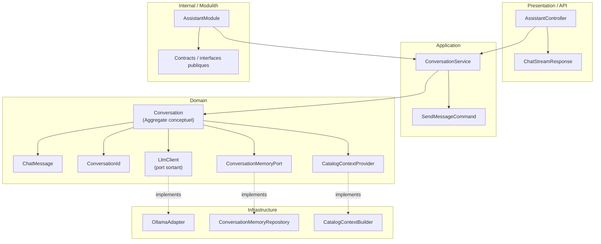

# Domaine Assistant

## Vue synthétique DDD + Modulith

Ce domaine gère une conversation comme un agrégat conceptuel, en séparant la logique d’interaction de l’intégration avec le LLM et la mémoire de conversation.

## Lecture du schéma

- La couche Presentation expose le flux conversationnel à l’utilisateur.
- La couche Application orchestre l’envoi de messages et la construction du contexte.
- La couche Domain contient l’agrégat Conversation et les ports d’intégration nécessaires.
- La couche Infrastructure implémente l’accès au LLM, à la mémoire et au contexte produit.
- Le cadre Internal / Modulith définit la frontière du module Assistant.

## Règle de dépendance essentielle

L’architecture reste dirigée selon la logique suivante :

Presentation → Application → Domain ← Infrastructure

Cela permet de conserver la conversation comme cœur du domaine, sans coupler directement le module au détail technique du modèle de langage.
