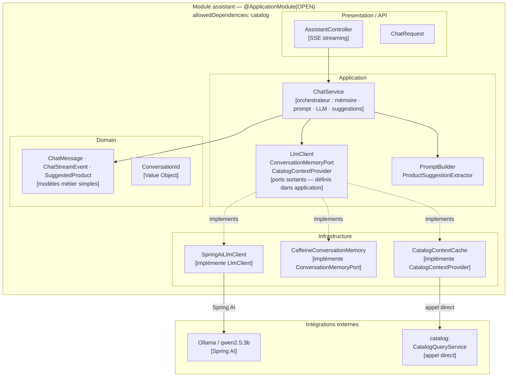

# Domaine Assistant

## Vue synthétique DDD + Modulith

Le module Assistant expose un assistant conversationnel IA (via Spring AI + Ollama, modèle configuré par `OLLAMA_MODEL` — `qwen2.5:3b` par défaut). Il maintient une mémoire de conversation par session (Caffeine cache) et enrichit les réponses avec le contexte du catalogue produit. Les ports d'intégration (`LlmClient`, `ConversationMemoryPort`, `CatalogContextProvider`) sont définis dans la couche Application — c'est le point d'extension vers l'infrastructure.



## Concepts DDD dans ce module

| Concept | Présent | Note |
|---|---|---|
| Aggregate Root | Absent | `ChatService` orchestre mais la conversation n'est pas un agrégat transactionnel |
| Value Object | `ConversationId` | Identifiant de session, typé fort |
| Modèles métier | `ChatMessage`, `SuggestedProduct`, `ChatStreamEvent` | Objets de valeur fonctionnels sans logique d'invariant |
| Ports sortants | `LlmClient`, `ConversationMemoryPort`, `CatalogContextProvider` | Définis dans **Application** (écart par rapport au DDD strict où les ports sont dans le Domain) |
| Domain Events | Aucun | Le module ne publie ni ne consomme d'événements |

## Contraintes Modulith

- **Type** : `OPEN`
- **allowedDependencies** : `catalog` — `CatalogContextCache` appelle directement `CatalogQueryService`
- Aucun événement consommé : la dépendance au catalogue est synchrone (lecture directe)
- La mémoire de conversation est **in-memory** (Caffeine) — non persistante entre redémarrages

## Règle de dépendance

```
Presentation → Application → Domain ← Infrastructure
```

Les ports `LlmClient`, `ConversationMemoryPort`, `CatalogContextProvider` sont définis dans la couche Application pour garder le Domain sans dépendance technique, tout en permettant à l'infrastructure de les implémenter.
