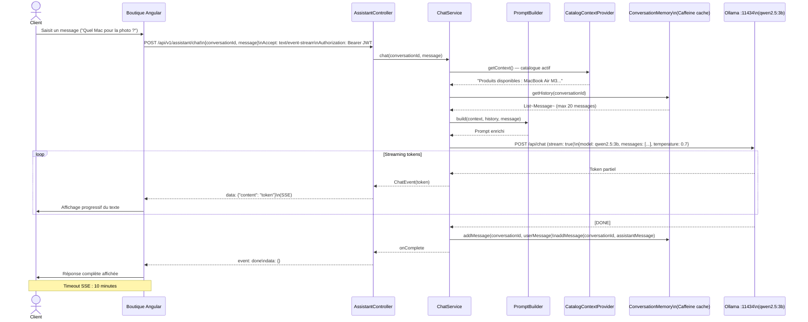

# Séquence — Assistant IA (SSE streaming)

Flux du chat avec l'assistant IA intégrant le contexte catalogue et le streaming SSE.

```mermaid
sequenceDiagram
    actor C as Client
    participant FC as Boutique Angular
    participant AC as AssistantController
    participant CS as ChatService
    participant PB as PromptBuilder
    participant CP as CatalogContextProvider
    participant MEM as ConversationMemory\n(Caffeine cache)
    participant OLL as Ollama :11434\n(qwen2.5:3b)

    C->>FC: Saisit un message ("Quel Mac pour la photo ?")
    FC->>AC: POST /api/v1/assistant/chat\n{conversationId, message}\nAccept: text/event-stream\nAuthorization: Bearer JWT

    AC->>CS: chat(conversationId, message)
    CS->>CP: getContext() — catalogue actif
    CP-->>CS: "Produits disponibles : MacBook Air M3..."
    CS->>MEM: getHistory(conversationId)
    MEM-->>CS: List~Message~ (max 20 messages)
    CS->>PB: build(context, history, message)
    PB-->>CS: Prompt enrichi

    CS->>OLL: POST /api/chat (stream: true)\n{model: qwen2.5:3b, messages: [...], temperature: 0.7}

    loop Streaming tokens
        OLL-->>CS: Token partiel
        CS-->>AC: ChatEvent(token)
        AC-->>FC: data: {"content": "token"}\n(SSE)
        FC->>C: Affichage progressif du texte
    end

    OLL-->>CS: [DONE]
    CS->>MEM: addMessage(conversationId, userMessage)\naddMessage(conversationId, assistantMessage)
    CS-->>AC: onComplete
    AC-->>FC: event: done\ndata: {}
    FC->>C: Réponse complète affichée

    Note over C, FC: Timeout SSE : 10 minutes
```
