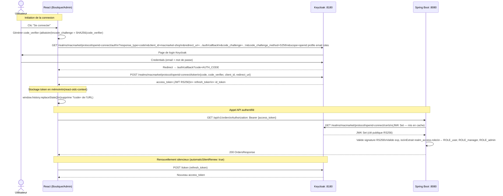

# Séquence — Authentification OIDC PKCE + validation JWT

Flux d'authentification complet entre le frontend React, Keycloak et l'API Spring Boot.

```mermaid
sequenceDiagram
    actor U as Utilisateur
    participant FC as React (Boutique/Admin)
    participant KC as Keycloak :8180
    participant API as Spring Boot :8080

    Note over U, FC: Initiation de la connexion

    U->>FC: Clic "Se connecter"
    FC->>FC: Générer code_verifier (aléatoire)\ncode_challenge = SHA256(code_verifier)

    FC->>KC: GET /realms/macmarket/protocol/openid-connect/auth\n?response_type=code\n&client_id=macmarket-shop\n&redirect_uri=.../auth/callback\n&code_challenge=...\n&code_challenge_method=S256\n&scope=openid profile email roles

    KC->>U: Page de login Keycloak

    U->>KC: Credentials (email + mot de passe)
    KC-->>FC: Redirect → /auth/callback?code=AUTH_CODE

    FC->>KC: POST /realms/macmarket/protocol/openid-connect/token\n{code, code_verifier, client_id, redirect_uri}
    KC-->>FC: access_token (JWT RS256)\n+ refresh_token\n+ id_token

    Note over FC: Stockage token en mémoire\n(react-oidc-context)
    FC->>FC: window.history.replaceState()\n(supprime ?code= de l'URL)

    Note over FC, API: Appel API authentifié

    FC->>API: GET /api/v1/orders\nAuthorization: Bearer {access_token}

    API->>KC: GET /realms/macmarket/protocol/openid-connect/certs\n(JWK Set — mis en cache)
    KC-->>API: JWK Set (clé publique RS256)

    API->>API: Valide signature RS256\nValide exp, iss\nExtrait realm_access.roles\n→ ROLE_user, ROLE_manager, ROLE_admin

    API-->>FC: 200 OrdersResponse

    Note over FC, KC: Renouvellement silencieux (automaticSilentRenew: true)

    FC->>KC: POST /token (refresh_token)
    KC-->>FC: Nouveau access_token
```
