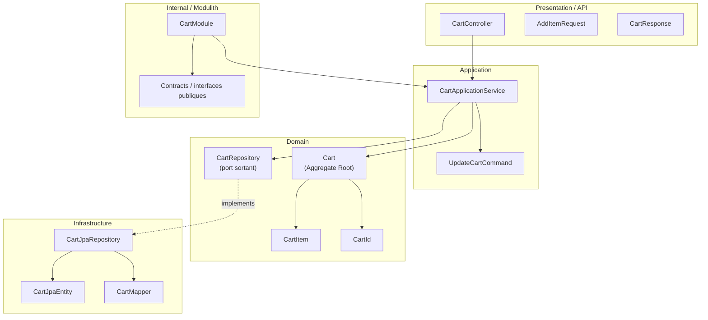

# Domaine Cart

## Vue synthétique DDD + Modulith

Ce schéma montre comment le bounded context Cart organise le panier autour d’un agrégat racine, tout en gardant la logique métier indépendante des détails techniques.

## Lecture du schéma

- La couche Presentation expose les opérations de consultation et modification du panier.
- La couche Application orchestre les cas d’usage liés à l’ajout, la mise à jour et la suppression d’articles.
- La couche Domain contient l’agrégat Cart, ses éléments internes et les règles de cohérence du panier.
- La couche Infrastructure implémente la persistance et l’adaptation technique.
- Le cadre Internal / Modulith définit la frontière du module Cart vis-à-vis des autres modules.

## Règle de dépendance essentielle

Le flux de dépendance reste orienté vers le cœur du domaine :

Presentation → Application → Domain ← Infrastructure

Cela garantit que les opérations sur le panier restent cohérentes sans dépendre directement des détails de stockage.
