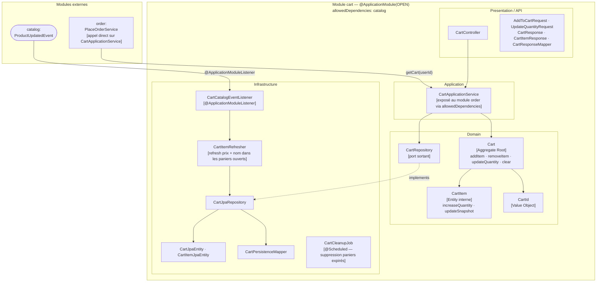

# Domaine Cart

## Vue synthétique DDD + Modulith

Le bounded context Cart gère le panier de l'utilisateur. Il ne publie pas d'événements métier propres, mais **consomme les événements de mise à jour produit** pour maintenir les snapshots de prix et de nom cohérents dans les items du panier. Il expose `CartApplicationService` directement au module `order` via l'appel synchrone lors de la création d'une commande.



## Concepts DDD dans ce module

| Concept | Présent | Note |
|---|---|---|
| Aggregate Root | `Cart` | Garantit la cohérence des items (unicité par productId) |
| Entity interne | `CartItem` | Non exposée directement à l'extérieur |
| Value Object | `CartId` | Identifiant typé fort |
| Domain Events | Non publiés | Le panier ne génère pas d'événements — la commande est créée par `order` |
| Repository (port) | `CartRepository` | Interface dans le domaine |
| Domain Events consommés | `ProductUpdatedEvent` | Via `CartCatalogEventListener` pour rafraîchir les snapshots |

## Contraintes Modulith

- **Type** : `OPEN`
- **allowedDependencies** : `catalog` — autorise l'écoute de `ProductUpdatedEvent` et l'accès à `CatalogQueryService`
- `CartApplicationService` est consommé directement par `order` (appel synchrone dans `PlaceOrderService`)
- `CartCleanupJob` gère le cycle de vie des paniers abandonnés sans événement métier

## Règle de dépendance

```
Presentation → Application → Domain ← Infrastructure
```

Le domaine `Cart` ne publie pas d'événements et ne connaît pas le module `order`. C'est `order` qui vient lire l'état du panier, non l'inverse.
