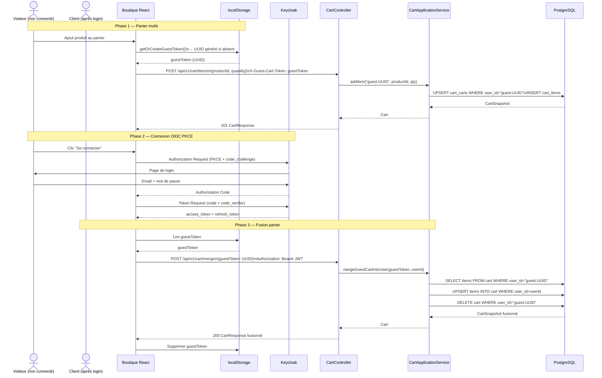

# Séquence — Panier invité et fusion après connexion

Flux du panier sans compte (guest token) jusqu'à la fusion après authentification.

```mermaid
sequenceDiagram
    actor V as Visiteur (non connecté)
    actor C as Client (après login)
    participant FC as Boutique React
    participant LS as localStorage
    participant KC as Keycloak
    participant CC as CartController
    participant CAS as CartApplicationService
    participant PG as PostgreSQL

    Note over V, LS: Phase 1 — Panier invité

    V->>FC: Ajout produit au panier
    FC->>LS: getOrCreateGuestToken()\n→ UUID généré si absent
    LS-->>FC: guestToken (UUID)

    FC->>CC: POST /api/v1/cart/items\n{productId, quantity}\nX-Guest-Cart-Token: guestToken
    CC->>CAS: addItem("guest:UUID", productId, qty)
    CAS->>PG: UPSERT cart_carts WHERE user_id="guest:UUID"\nINSERT cart_items
    PG-->>CAS: CartSnapshot
    CAS-->>CC: Cart
    CC-->>FC: 201 CartResponse

    Note over V, KC: Phase 2 — Connexion OIDC PKCE

    V->>FC: Clic "Se connecter"
    FC->>KC: Authorization Request (PKCE + code_challenge)
    KC->>V: Page de login
    V->>KC: Email + mot de passe
    KC-->>FC: Authorization Code
    FC->>KC: Token Request (code + code_verifier)
    KC-->>FC: access_token + refresh_token

    Note over C, CAS: Phase 3 — Fusion panier

    FC->>LS: Lire guestToken
    LS-->>FC: guestToken

    FC->>CC: POST /api/v1/cart/merge\n{guestToken: UUID}\nAuthorization: Bearer JWT
    CC->>CAS: mergeGuestCartIntoUser(guestToken, userId)
    CAS->>PG: SELECT items FROM cart WHERE user_id="guest:UUID"
    CAS->>PG: UPSERT items INTO cart WHERE user_id=userId
    CAS->>PG: DELETE cart WHERE user_id="guest:UUID"
    PG-->>CAS: CartSnapshot fusionné
    CAS-->>CC: Cart
    CC-->>FC: 200 CartResponse fusionné

    FC->>LS: Supprimer guestToken
```
