# Domaine Catalog — Diagramme de classes

Vue complémentaire à [catalog-domain.md](./catalog-domain.md) (flowchart synthétique) : diagramme de classes détaillé du bounded context `catalog`, organisé selon les quatre couches DDD (`presentation`, `application`, `domain`, `infrastructure`) plus le socle commun (`com.macmarket`). Chaque zone correspond à un package Java ; les couleurs identifient le rôle DDD de chaque classe (agrégat, value object, port, event, service applicatif, etc.).

```mermaid
classDiagram
    namespace Presentation {
        class CatalogController:::controller
        class CreateProductRequest:::dto
        class UpdateProductRequest:::dto
        class ProductResponse:::dto
        class CategoryCountResponse:::dto
        class ProductResponseMapper:::mapper
    }

    namespace Application {
        class CreateProductCommand:::command
        class UpdateProductCommand:::command
        class CreateProductService:::appService
        class UpdateProductService:::appService
        class CatalogQueryService:::appService
        class DomainEventPublisher:::port
    }

    namespace Domain {
        class Product:::aggregate
        class ProductId:::valueObject
        class Money:::valueObject
        class ProductCategory:::valueObject
        class ProductSpec:::valueObject
        class ProductRepository:::port
        class ProductQueryCriteria:::valueObject
        class ProductPage:::valueObject
        class CategoryCount:::valueObject
        class DomainEvent:::domainEvent
        class ProductCreatedEvent:::domainEvent
        class ProductUpdatedEvent:::domainEvent
        class ProductDeletedEvent:::domainEvent
        class StockInsufficientEvent:::domainEvent
        class ProductNotFoundException:::exception
    }

    namespace Infrastructure {
        class ProductJpaRepository:::infra
        class ProductSpringDataRepository:::infra
        class ProductJpaEntity:::jpaEntity
        class ProductSpecJpaEntity:::jpaEntity
        class ProductPersistenceMapper:::mapper
        class SpringDomainEventPublisher:::infra
        class OrderStockEventListener:::infra
    }

    namespace Commun {
        class DomainException:::exception
        class NotFoundException:::exception
    }

    %% ===== Presentation =====
    class CatalogController {
        <<Controller>>
        -CatalogQueryService queryService
        -CreateProductService createProductService
        -UpdateProductService updateProductService
        -ProductResponseMapper responseMapper
        +listProducts(page, size, sort, category, search, minPrice, maxPrice) ResponseEntity
        +getBySlug(slug String) ResponseEntity~ProductResponse~
        +getCategories() ResponseEntity~List~CategoryCountResponse~~
        +createProduct(request CreateProductRequest) ResponseEntity~ProductResponse~
        +updateProduct(id UUID, request UpdateProductRequest) ResponseEntity~ProductResponse~
        +deleteProduct(id UUID) ResponseEntity~Void~
    }

    class CreateProductRequest {
        <<DTO Request>>
        +String name
        +String slug
        +String description
        +String shortDesc
        +BigDecimal price
        +String category
        +String imageUrl
        +int stockQuantity
        +Map~String,String~ specs
    }

    class UpdateProductRequest {
        <<DTO Request>>
        +String name
        +String description
        +String shortDesc
        +BigDecimal price
        +String category
        +String imageUrl
        +Integer stockQuantity
        +Boolean active
        +Map~String,String~ specs
    }

    class ProductResponse {
        <<DTO Response>>
        +UUID id
        +String name
        +String slug
        +String description
        +String shortDesc
        +BigDecimal price
        +String category
        +String imageUrl
        +int stockQuantity
        +int reservedQuantity
        +boolean active
        +Map~String,String~ specs
        +Instant createdAt
    }

    class CategoryCountResponse {
        <<DTO Response>>
        +String category
        +long count
    }

    class ProductResponseMapper {
        <<Mapper>>
        +toResponse(product Product) ProductResponse
    }

    %% ===== Application =====
    class CreateProductCommand {
        <<Command>>
        +String name
        +String slug
        +String description
        +String shortDesc
        +BigDecimal price
        +String category
        +String imageUrl
        +int stockQuantity
        +Map~String,String~ specs
    }

    class UpdateProductCommand {
        <<Command>>
        +UUID productId
        +String name
        +String description
        +String shortDesc
        +BigDecimal price
        +String category
        +String imageUrl
        +Integer stockQuantity
        +Map~String,String~ specs
    }

    class CreateProductService {
        <<Application Service>>
        -ProductRepository productRepository
        -DomainEventPublisher eventPublisher
        +execute(command CreateProductCommand) Product
    }

    class UpdateProductService {
        <<Application Service>>
        -ProductRepository productRepository
        -DomainEventPublisher eventPublisher
        +execute(command UpdateProductCommand) Product
        +deactivate(productId UUID) void
    }

    class CatalogQueryService {
        <<Application Service>>
        -ProductRepository productRepository
        +findById(id ProductId) Product
        +findBySlug(slug String) Product
        +findAll(active, category, minPrice, maxPrice, search, page, size, sort) ProductPage
        +getCategories() List~CategoryCount~
    }

    class DomainEventPublisher {
        <<Interface>>
        +publish(events List~DomainEvent~) void
    }

    %% ===== Domain =====
    class Product {
        <<Aggregate Root>>
        -ProductId id
        -String name
        -String slug
        -String description
        -String shortDesc
        -Money price
        -ProductCategory category
        -String imageUrl
        -int stockQuantity
        -int reservedQuantity
        -boolean active
        -List~ProductSpec~ specs
        -Instant createdAt
        -List~DomainEvent~ domainEvents
        +create(name, slug, description, shortDesc, price, category, imageUrl, stockQuantity, specs) Product
        +reconstitute(id, name, slug, description, shortDesc, price, category, imageUrl, stockQuantity, reservedQuantity, active, specs, createdAt) Product
        +updateDetails(name, description, shortDesc, price, category, imageUrl, stockQuantity, specs) void
        +deactivate() void
        +reserveStock(quantity int) void
        +confirmStockReservation(quantity int) void
        +releaseStock(quantity int) void
        +availableQuantity() int
        +pullDomainEvents() List~DomainEvent~
    }

    class ProductId {
        <<Value Object>>
        +UUID value
        +generate() ProductId
        +of(value UUID) ProductId
    }

    class Money {
        <<Value Object>>
        +BigDecimal amount
        +ZERO Money
        +of(amount BigDecimal) Money
        +multiply(quantity int) Money
        +add(other Money) Money
    }

    class ProductCategory {
        <<Enumeration>>
        MACBOOK_AIR
        MACBOOK_PRO
        IMAC
        MAC_MINI
        MAC_STUDIO
        MAC_PRO
    }

    class ProductSpec {
        <<Value Object>>
        +String key
        +String value
        +int sortOrder
    }

    class ProductRepository {
        <<Interface>>
        +save(product Product) void
        +findById(id ProductId) Optional~Product~
        +findBySlug(slug String) Optional~Product~
        +findAll(criteria ProductQueryCriteria) ProductPage
        +countByCategory() List~CategoryCount~
    }

    class ProductQueryCriteria {
        <<Record>>
        +Boolean active
        +ProductCategory category
        +BigDecimal minPrice
        +BigDecimal maxPrice
        +String search
        +int page
        +int size
        +String sortField
        +String sortDirection
    }

    class ProductPage {
        <<Record>>
        +List~Product~ content
        +int totalElements
        +int totalPages
        +int size
        +int number
    }

    class CategoryCount {
        <<Record>>
        +String category
        +long count
    }

    class DomainEvent {
        <<Interface>>
        +occurredOn() Instant
    }

    class ProductCreatedEvent {
        <<Domain Event>>
        +ProductId productId
        +String name
        +Money price
        +Instant occurredOn
    }

    class ProductUpdatedEvent {
        <<Domain Event>>
        +ProductId productId
        +Instant occurredOn
    }

    class ProductDeletedEvent {
        <<Domain Event>>
        +ProductId productId
        +Instant occurredOn
    }

    class StockInsufficientEvent {
        <<Domain Event>>
        +ProductId productId
        +UUID orderId
        +int requestedQuantity
        +int availableQuantity
        +Instant occurredOn
    }

    class ProductNotFoundException {
        <<Exception>>
        +ProductNotFoundException(id ProductId)
        +ProductNotFoundException(slug String)
    }

    %% ===== Infrastructure =====
    class ProductJpaRepository {
        <<Repository Impl>>
        -ProductSpringDataRepository springData
        -ProductPersistenceMapper mapper
        +save(product Product) void
        +findById(id ProductId) Optional~Product~
        +findBySlug(slug String) Optional~Product~
        +findAll(criteria ProductQueryCriteria) ProductPage
        +countByCategory() List~CategoryCount~
    }

    class ProductSpringDataRepository {
        <<Spring Data Repository>>
        +findBySlug(slug String) Optional~ProductJpaEntity~
        +findFiltered(active, category, minPrice, maxPrice, search, pageable) Page~ProductJpaEntity~
        +countByCategory() List~Object[]~
    }

    class ProductJpaEntity {
        <<JPA Entity>>
        -UUID id
        -String name
        -String slug
        -String description
        -String shortDesc
        -BigDecimal price
        -String category
        -String imageUrl
        -int stockQuantity
        -int reservedQuantity
        -boolean active
        -Instant createdAt
        -Instant updatedAt
        -List~ProductSpecJpaEntity~ specs
    }

    class ProductSpecJpaEntity {
        <<JPA Entity>>
        -UUID id
        -ProductJpaEntity product
        -String specKey
        -String specValue
        -int sortOrder
    }

    class ProductPersistenceMapper {
        <<Mapper>>
        +toDomain(entity ProductJpaEntity) Product
        +toJpa(product Product) ProductJpaEntity
    }

    class SpringDomainEventPublisher {
        <<Event Publisher Impl>>
        -ApplicationEventPublisher springPublisher
        +publish(events List~DomainEvent~) void
    }

    class OrderStockEventListener {
        <<Event Listener>>
        -ProductRepository productRepository
        +onOrderPlaced(event OrderPlacedEvent) void
        +onOrderStatusChanged(event OrderStatusChangedEvent) void
    }

    %% ===== Commun =====
    class DomainException {
        <<Exception>>
        +String message
    }

    class NotFoundException {
        <<Exception>>
    }

    %% ===== Relations : Domain =====
    Product "1" *-- "many" ProductSpec : specs
    Product --> ProductId : id
    Product --> Money : price
    Product --> ProductCategory : category
    Product ..> DomainEvent : émet

    ProductCreatedEvent ..|> DomainEvent
    ProductUpdatedEvent ..|> DomainEvent
    ProductDeletedEvent ..|> DomainEvent
    StockInsufficientEvent ..|> DomainEvent

    ProductCreatedEvent --> ProductId
    ProductCreatedEvent --> Money
    ProductUpdatedEvent --> ProductId
    ProductDeletedEvent --> ProductId
    StockInsufficientEvent --> ProductId

    ProductRepository ..> Product : gère
    ProductRepository --> ProductQueryCriteria
    ProductRepository --> ProductPage
    ProductRepository --> CategoryCount
    ProductPage --> Product : content

    NotFoundException --|> DomainException
    ProductNotFoundException --|> NotFoundException
    ProductNotFoundException ..> ProductId

    %% ===== Relations : Application → Domain =====
    CreateProductService --> ProductRepository : utilise
    CreateProductService --> DomainEventPublisher : utilise
    CreateProductService ..> CreateProductCommand : reçoit
    CreateProductService ..> Product : crée

    UpdateProductService --> ProductRepository : utilise
    UpdateProductService --> DomainEventPublisher : utilise
    UpdateProductService ..> UpdateProductCommand : reçoit
    UpdateProductService ..> Product : modifie
    UpdateProductService ..> ProductNotFoundException : lève

    CatalogQueryService --> ProductRepository : utilise
    CatalogQueryService ..> Product : lit
    CatalogQueryService ..> ProductNotFoundException : lève

    %% ===== Relations : Infrastructure → Domain/Application =====
    ProductJpaRepository ..|> ProductRepository : implements
    ProductJpaRepository --> ProductSpringDataRepository
    ProductJpaRepository --> ProductPersistenceMapper
    ProductSpringDataRepository --> ProductJpaEntity
    ProductJpaEntity "1" *-- "many" ProductSpecJpaEntity : specs
    ProductPersistenceMapper --> ProductJpaEntity
    ProductPersistenceMapper ..> Product

    SpringDomainEventPublisher ..|> DomainEventPublisher : implements

    OrderStockEventListener --> ProductRepository : utilise
    OrderStockEventListener ..> Product : réserve / confirme / libère le stock

    %% ===== Relations : Presentation → Application =====
    CatalogController --> CatalogQueryService : utilise
    CatalogController --> CreateProductService : utilise
    CatalogController --> UpdateProductService : utilise
    CatalogController --> ProductResponseMapper : utilise
    CatalogController ..> CreateProductRequest : reçoit
    CatalogController ..> UpdateProductRequest : reçoit
    CatalogController ..> CreateProductCommand : construit
    CatalogController ..> UpdateProductCommand : construit
    CatalogController --> ProductResponse
    CatalogController --> CategoryCountResponse

    ProductResponseMapper ..> Product : lit
    ProductResponseMapper --> ProductResponse : produit

    %% ===== Styles par rôle DDD (doivent être déclarés après les classes) =====
    classDef aggregate fill:#FFE0B2,stroke:#E65100,stroke-width:2px,color:#5D4037
    classDef valueObject fill:#BBDEFB,stroke:#0D47A1,stroke-width:1px,color:#0D47A1
    classDef domainEvent fill:#C8E6C9,stroke:#1B5E20,stroke-width:1px,color:#1B5E20
    classDef port fill:#D1C4E9,stroke:#4527A0,stroke-width:1px,color:#4527A0
    classDef exception fill:#FFCDD2,stroke:#B71C1C,stroke-width:1px,color:#B71C1C
    classDef appService fill:#B2DFDB,stroke:#00695C,stroke-width:1px,color:#00695C
    classDef command fill:#FFF9C4,stroke:#F9A825,stroke-width:1px,color:#8D6E00
    classDef controller fill:#F8BBD0,stroke:#AD1457,stroke-width:2px,color:#AD1457
    classDef dto fill:#ECEFF1,stroke:#455A64,stroke-width:1px,color:#455A64
    classDef mapper fill:#D7CCC8,stroke:#4E342E,stroke-width:1px,color:#4E342E
    classDef infra fill:#FFCCBC,stroke:#BF360C,stroke-width:1px,color:#BF360C
    classDef jpaEntity fill:#EFEBE9,stroke:#3E2723,stroke-width:1px,color:#3E2723
```

## Légende des couleurs (rôle DDD)

| Couleur | Rôle DDD | Classes |
|---|---|---|
| 🟧 Orange | Aggregate Root | `Product` |
| 🟦 Bleu | Value Object / Record de données | `ProductId`, `Money`, `ProductCategory`, `ProductSpec`, `ProductQueryCriteria`, `ProductPage`, `CategoryCount` |
| 🟩 Vert | Domain Event | `DomainEvent`, `ProductCreatedEvent`, `ProductUpdatedEvent`, `ProductDeletedEvent`, `StockInsufficientEvent` |
| 🟪 Violet | Port (interface sortante) | `ProductRepository`, `DomainEventPublisher` |
| 🟥 Rouge | Exception | `DomainException`, `NotFoundException`, `ProductNotFoundException` |
| 🟦 Teal | Application Service | `CreateProductService`, `UpdateProductService`, `CatalogQueryService` |
| 🟨 Jaune | Command | `CreateProductCommand`, `UpdateProductCommand` |
| 🩷 Rose | Controller | `CatalogController` |
| ⬜ Gris-bleu | DTO (Request/Response) | `CreateProductRequest`, `UpdateProductRequest`, `ProductResponse`, `CategoryCountResponse` |
| 🟫 Taupe | Mapper | `ProductResponseMapper`, `ProductPersistenceMapper` |
| 🟠 Brique | Adapter d'infrastructure | `ProductJpaRepository`, `ProductSpringDataRepository`, `SpringDomainEventPublisher`, `OrderStockEventListener` |
| ⬛ Beige foncé | Entité JPA (technique) | `ProductJpaEntity`, `ProductSpecJpaEntity` |

## Notes

- Les quatre zones (`Presentation`, `Application`, `Domain`, `Infrastructure`) correspondent aux packages `catalog.presentation`, `catalog.application`, `catalog.domain` et `catalog.infrastructure`. La zone `Commun` regroupe le socle partagé `com.macmarket` (`DomainException`, `NotFoundException`).
- La règle de dépendance DDD est respectée : `Presentation → Application → Domain ← Infrastructure`. Le domaine ne dépend d'aucune autre couche.
- `Product` est l'agrégat racine : toutes les mutations (`updateDetails`, `deactivate`, `reserveStock`, `confirmStockReservation`, `releaseStock`) passent par ses méthodes de comportement, sans setter public.
- `ProductRepository` et `DomainEventPublisher` sont des ports sortants définis respectivement dans le domaine et l'application, implémentés en infrastructure par `ProductJpaRepository` et `SpringDomainEventPublisher`.
- `OrderStockEventListener` dépend aussi d'événements du module `order` (`OrderPlacedEvent`, `OrderStatusChangedEvent`), non représentés ici — voir [catalog-domain.md](./catalog-domain.md) pour la vue inter-modules.
- `ProductNotFoundException` hérite de `NotFoundException` (→ `DomainException`), traduite en HTTP 404 par le `GlobalExceptionHandler` global.
