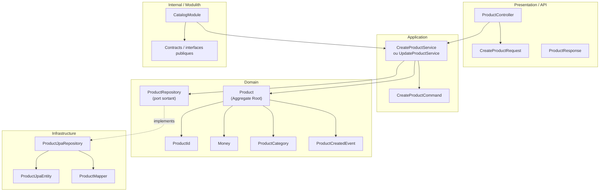

# Domaine Catalog

## Vue synthétique DDD + Modulith

Cette vue montre comment le bounded context Catalog s’organise autour d’un agrégat Product, avec une séparation nette entre API, cas d’usage, logique métier, persistence et frontière de module.

## Lecture du schéma

- La couche Presentation expose les opérations de gestion du catalogue.
- La couche Application orchestre la création et la mise à jour des produits sans contenir la logique métier complète.
- La couche Domain contient l’agrégat Product, ses objets de valeur et ses événements métier.
- La couche Infrastructure implémente le repository et la persistance technique.
- Le cadre Internal / Modulith représente la frontière du module Catalog et son interface avec les autres modules.

## Règle de dépendance essentielle

La dépendance reste dirigée selon l’architecture suivante :

Presentation → Application → Domain ← Infrastructure

Cette structure permet de préserver les invariants de stock, de disponibilité et de publication du produit au cœur du domaine.
