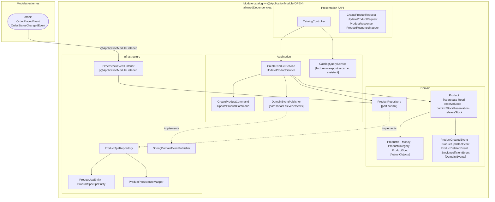

# Domaine Catalog

## Vue synthétique DDD + Modulith

Le bounded context Catalog gère le cycle de vie des produits. Il publie des événements métier à chaque modification de produit, et **consomme en retour les événements de commande** pour gérer la réservation et la libération du stock côté domaine.



## Concepts DDD dans ce module

| Concept | Présent | Note |
|---|---|---|
| Aggregate Root | `Product` | Protège les invariants de stock via `reserveStock` / `confirmStockReservation` / `releaseStock` |
| Value Objects | `ProductId`, `Money`, `ProductCategory`, `ProductSpec` | Immuables, auto-validants |
| Domain Events | `ProductCreated/Updated/Deleted`, `StockInsufficient` | Publiés via `DomainEventPublisher` après persistence |
| Repository (port) | `ProductRepository` | Interface dans le domaine, implémentée en infrastructure |
| Domain Events consommés | `OrderPlacedEvent`, `OrderStatusChangedEvent` | Via `OrderStockEventListener` pour gérer le stock |

## Contraintes Modulith

- **Type** : `OPEN`
- **allowedDependencies** : `order` — autorise l'écoute des événements de commande
- `CatalogQueryService` est accessible directement par les modules `cart` et `assistant` (via `allowedDependencies`)
- `SpringDomainEventPublisher` publie via `ApplicationEventPublisher` Spring, capturé par Spring Modulith

## Règle de dépendance

```
Presentation → Application → Domain ← Infrastructure
```

Le domaine ne connaît ni Spring, ni JPA. L'infrastructure implémente les ports définis dans le domaine (`ProductRepository`, `DomainEventPublisher`).

Pour une vue détaillée classe par classe (attributs, méthodes, légende de couleurs par rôle DDD), voir [catalog-domain-classes.md](./catalog-domain-classes.md).
