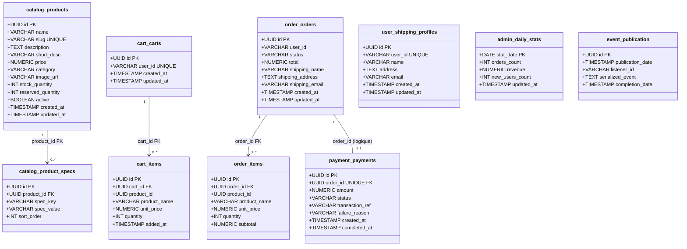

# Modèle de données — Schéma PostgreSQL

Tables physiques gérées par Flyway (V1 à V8).

```mermaid
classDiagram
    direction TB

    class catalog_products {
        +UUID id PK
        +VARCHAR name
        +VARCHAR slug UNIQUE
        +TEXT description
        +VARCHAR short_desc
        +NUMERIC price
        +VARCHAR category
        +VARCHAR image_url
        +INT stock_quantity
        +INT reserved_quantity
        +BOOLEAN active
        +TIMESTAMP created_at
        +TIMESTAMP updated_at
    }

    class catalog_product_specs {
        +UUID id PK
        +UUID product_id FK
        +VARCHAR spec_key
        +VARCHAR spec_value
        +INT sort_order
    }

    class cart_carts {
        +UUID id PK
        +VARCHAR user_id UNIQUE
        +TIMESTAMP created_at
        +TIMESTAMP updated_at
    }

    class cart_items {
        +UUID id PK
        +UUID cart_id FK
        +UUID product_id
        +VARCHAR product_name
        +NUMERIC unit_price
        +INT quantity
        +TIMESTAMP added_at
    }

    class order_orders {
        +UUID id PK
        +VARCHAR user_id
        +VARCHAR status
        +NUMERIC total
        +VARCHAR shipping_name
        +TEXT shipping_address
        +VARCHAR shipping_email
        +TIMESTAMP created_at
        +TIMESTAMP updated_at
    }

    class order_items {
        +UUID id PK
        +UUID order_id FK
        +UUID product_id
        +VARCHAR product_name
        +NUMERIC unit_price
        +INT quantity
        +NUMERIC subtotal
    }

    class payment_payments {
        +UUID id PK
        +UUID order_id UNIQUE FK
        +NUMERIC amount
        +VARCHAR status
        +VARCHAR transaction_ref
        +VARCHAR failure_reason
        +TIMESTAMP created_at
        +TIMESTAMP completed_at
    }

    class user_shipping_profiles {
        +UUID id PK
        +VARCHAR user_id UNIQUE
        +VARCHAR name
        +TEXT address
        +VARCHAR email
        +TIMESTAMP created_at
        +TIMESTAMP updated_at
    }

    class admin_daily_stats {
        +DATE stat_date PK
        +INT orders_count
        +NUMERIC revenue
        +INT new_users_count
        +TIMESTAMP updated_at
    }

    class event_publication {
        +UUID id PK
        +TIMESTAMP publication_date
        +VARCHAR listener_id
        +TEXT serialized_event
        +TIMESTAMP completion_date
    }

    catalog_products "1" --> "0..*" catalog_product_specs : product_id FK
    cart_carts "1" --> "0..*" cart_items : cart_id FK
    order_orders "1" --> "1..*" order_items : order_id FK
    order_orders "1" -- "0..1" payment_payments : order_id (logique)
```
