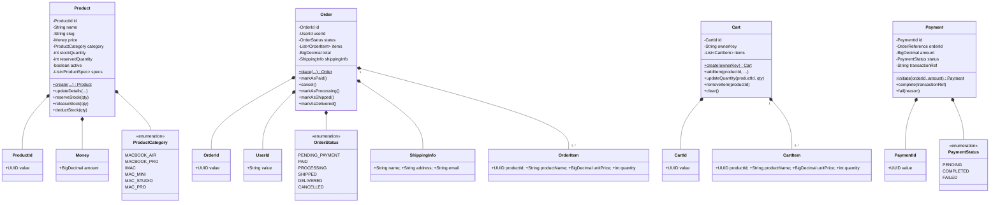

# Classes — Agrégats DDD principaux

Représentation des agrégats, entités et Value Objects du domaine MacMarket.

```mermaid
classDiagram
    direction TB

    class Product {
        -ProductId id
        -String name
        -String slug
        -Money price
        -ProductCategory category
        -int stockQuantity
        -int reservedQuantity
        -boolean active
        -List~ProductSpec~ specs
        +create(...) Product$
        +updateDetails(...)
        +reserveStock(qty)
        +releaseStock(qty)
        +deductStock(qty)
    }

    class Order {
        -OrderId id
        -UserId userId
        -OrderStatus status
        -List~OrderItem~ items
        -BigDecimal total
        -ShippingInfo shippingInfo
        +place(...) Order$
        +markAsPaid()
        +cancel()
        +markAsProcessing()
        +markAsShipped()
        +markAsDelivered()
    }

    class Cart {
        -CartId id
        -String ownerKey
        -List~CartItem~ items
        +create(ownerKey) Cart$
        +addItem(productId, ...)
        +updateQuantity(productId, qty)
        +removeItem(productId)
        +clear()
    }

    class Payment {
        -PaymentId id
        -OrderReference orderId
        -BigDecimal amount
        -PaymentStatus status
        -String transactionRef
        +initiate(orderId, amount) Payment$
        +complete(transactionRef)
        +fail(reason)
    }

    class OrderStatus {
        <<enumeration>>
        PENDING_PAYMENT
        PAID
        PROCESSING
        SHIPPED
        DELIVERED
        CANCELLED
    }

    class PaymentStatus {
        <<enumeration>>
        PENDING
        COMPLETED
        FAILED
    }

    class ProductCategory {
        <<enumeration>>
        MACBOOK_AIR
        MACBOOK_PRO
        IMAC
        MAC_MINI
        MAC_STUDIO
        MAC_PRO
    }

    class OrderId { +UUID value }
    class ProductId { +UUID value }
    class CartId { +UUID value }
    class PaymentId { +UUID value }
    class UserId { +String value }
    class Money { +BigDecimal amount }
    class ShippingInfo { +String name; +String address; +String email }

    Order *-- OrderId
    Order *-- UserId
    Order *-- OrderStatus
    Order *-- ShippingInfo
    Order "1" *-- "1..*" OrderItem

    Product *-- ProductId
    Product *-- Money
    Product *-- ProductCategory

    Cart *-- CartId
    Cart "1" *-- "0..*" CartItem

    Payment *-- PaymentId
    Payment *-- PaymentStatus

    class OrderItem { +UUID productId; +String productName; +BigDecimal unitPrice; +int quantity }
    class CartItem { +UUID productId; +String productName; +BigDecimal unitPrice; +int quantity }
```
