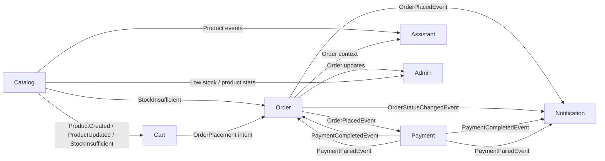

# Vue d’ensemble inter-domaines

## Flux principaux d’événements

## Description

- Le catalogue publie des événements produits qui peuvent influencer le panier et l’assistant.
- Le panier prépare la commande, qui est ensuite traitée par le domaine order.
- Le domaine order déclenche des notifications et initie le paiement.
- Le paiement notifie ensuite l’order et les notifications de son succès ou de son échec.
- L’admin consomme les données de commande et de stock pour proposer une supervision métier.
