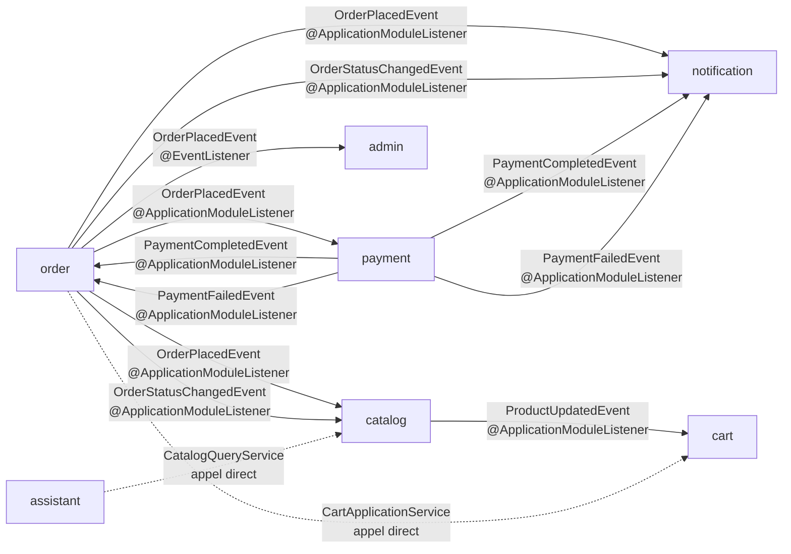

# Vue d'ensemble inter-domaines

## Flux d'événements et dépendances directes

Ce schéma montre les deux types de couplage entre modules : les **événements asynchrones** (publiés via Spring Modulith) et les **appels directs synchrones** (autorisés par `allowedDependencies`).



## Tableau des consommateurs par événement

| Événement publié par | Événement | Consommateurs | Mécanisme |
|---|---|---|---|
| `order` | `OrderPlacedEvent` | `payment`, `catalog`, `notification`, `admin` | `@ApplicationModuleListener` (sauf `admin` : `@EventListener`) |
| `order` | `OrderStatusChangedEvent` | `catalog`, `notification` | `@ApplicationModuleListener` |
| `payment` | `PaymentCompletedEvent` | `order`, `notification` | `@ApplicationModuleListener` |
| `payment` | `PaymentFailedEvent` | `order`, `notification` | `@ApplicationModuleListener` |
| `catalog` | `ProductUpdatedEvent` | `cart` | `@ApplicationModuleListener` |

## Différence @ApplicationModuleListener vs @EventListener

| | `@ApplicationModuleListener` | `@EventListener` |
|---|---|---|
| Timing | Après commit de la transaction source | Dans la même transaction (synchrone) |
| Isolation | Exécution indépendante — une erreur dans le listener ne rollback pas l'émetteur | Une erreur peut rollback l'émetteur |
| Usage dans ce projet | Payment, Catalog, Cart, Notification, Order | Admin uniquement |

## Appels directs synchrones

Ces couplages sont explicites dans la configuration Modulith via `allowedDependencies` :

- **`order` → `cart`** : `PlaceOrderService` lit `CartApplicationService.getCart(userId)` pour construire la commande
- **`assistant` → `catalog`** : `CatalogContextCache` lit `CatalogQueryService` pour enrichir le contexte IA

## Flux du scénario principal (achat)

```
1. [user] POST /api/orders
      │
      ▼
2. order.PlaceOrderService
      │── lit cart.CartApplicationService (sync)
      │── crée l'agrégat Order
      │── publie OrderPlacedEvent
      │
      ├──▶ payment.OrderEventListener ──▶ ProcessPaymentService
      │         │── publie PaymentCompletedEvent
      │         │       ├──▶ order.PaymentEventListener ──▶ UpdateOrderStatusService (PAID)
      │         │       │       └── publie OrderStatusChangedEvent
      │         │       │               ├──▶ catalog.OrderStockEventListener (confirmStockReservation)
      │         │       │               └──▶ notification (email statut)
      │         │       └──▶ notification (email paiement confirmé)
      │
      ├──▶ catalog.OrderStockEventListener (reserveStock)
      │
      ├──▶ notification (email confirmation commande)
      │
      └──▶ admin.AdminEventListener (stats quotidiennes)
```
