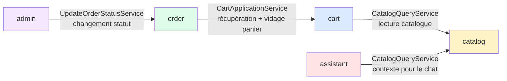
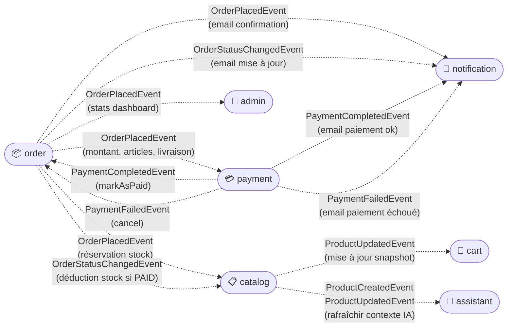

# Modules et dépendances inter-modules

Dépendances directes (appels de services) et communication par événements entre les 8 modules Spring Modulith.

## Dépendances directes

## Communication par événements (Spring Modulith)

