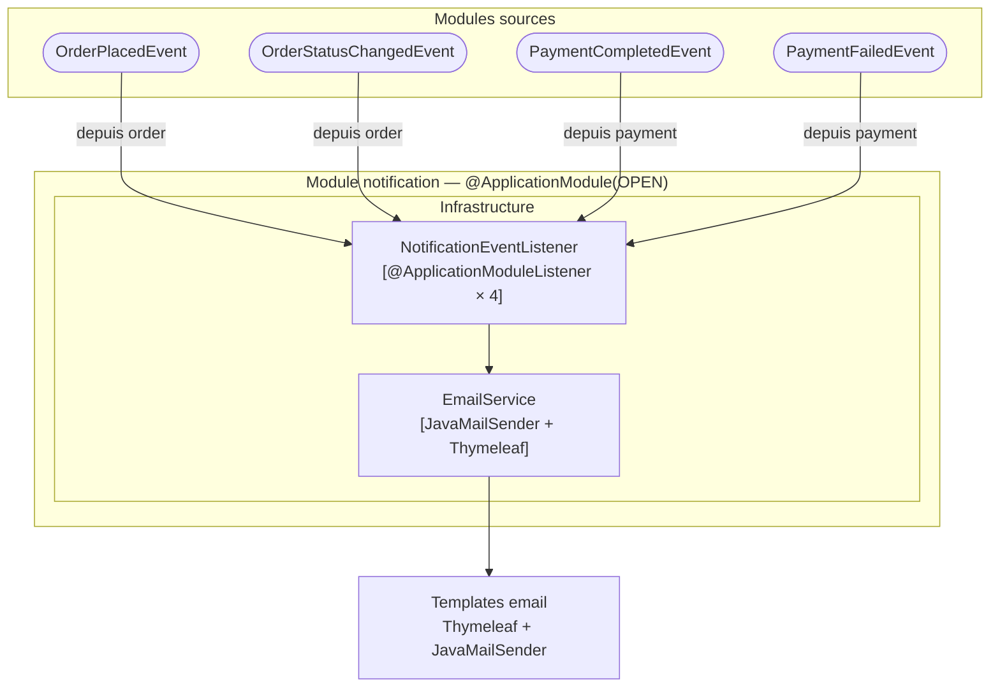

# Domaine Notification

## Vue synthétique DDD + Modulith

Ce module est un **consommateur pur d'événements**. Il n'a ni couche Presentation, ni Application, ni Domain propre — son rôle est de traduire directement les événements métier d'autres modules en emails envoyés à l'utilisateur via Thymeleaf.



## Concepts DDD dans ce module

| Concept | Présent | Note |
|---|---|---|
| Aggregate Root | Non | Aucun état métier propre — module stateless |
| Value Objects | Non | Les données viennent directement des événements reçus |
| Domain Events | Consomme uniquement | 4 événements reçus de `order` et `payment` |
| Repository (port) | Non | Pas de persistance propre |
| Application Service | Non | Pas d'orchestration — listener → mailer direct |

## Contraintes Modulith

- **Type** : `OPEN` — les classes du module sont visibles par les autres modules
- **allowedDependencies** : `order`, `payment` — seuls ces modules peuvent être importés dans le code du module notification
- **@ApplicationModuleListener** : les 4 méthodes s'exécutent de façon transactionnelle et indépendante par rapport à l'émetteur (déclenchement après commit de la transaction source)

## Flux d'événements

```
order  ──OrderPlacedEvent──────────▶ notification ──▶ email
order  ──OrderStatusChangedEvent──▶ notification ──▶ email
payment ──PaymentCompletedEvent───▶ notification ──▶ email
payment ──PaymentFailedEvent──────▶ notification ──▶ email
```

Ce module ne publie aucun événement. Il est un consommateur terminal des flux métier.
