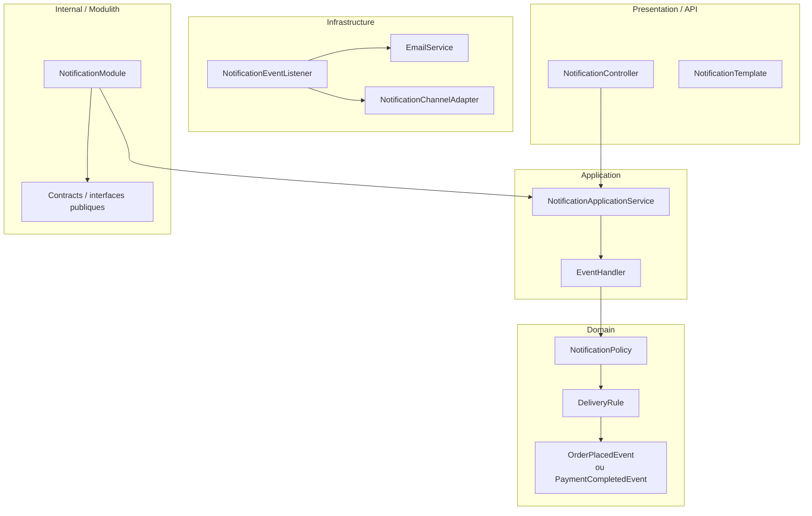

# Domaine Notification

## Vue synthétique DDD + Modulith

Ce domaine agit principalement comme un consommateur d’événements métier. Son rôle est de transformer des événements issus d’autres modules en notifications utiles pour les utilisateurs.

## Lecture du schéma

- La couche Presentation expose les templates et points d’entrée de notification.
- La couche Application orchestre la logique de diffusion à partir des événements reçus.
- La couche Domain contient les règles métier de notification et le traitement des événements.
- La couche Infrastructure implémente l’écoute et l’envoi sur un canal technique.
- Le cadre Internal / Modulith représente la frontière du module Notification.

## Règle de dépendance essentielle

Le module respecte la séquence suivante :

Presentation → Application → Domain ← Infrastructure

L’intérêt principal est d’isoler la logique de notification des détails d’intégration avec les canaux de communication.
