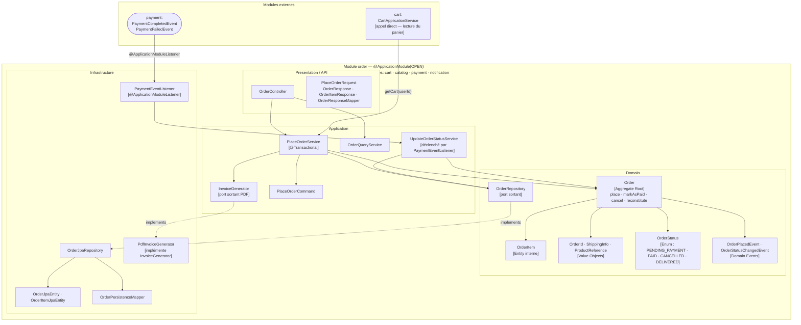

# Domaine Order

## Vue synthétique DDD + Modulith

Le bounded context Order est le cœur transactionnel du système. Il orchestre la création d'une commande depuis le panier, publie des événements métier qui déclenchent le paiement et les notifications, et réagit aux événements de paiement pour mettre à jour son propre état. Il dépend directement de `cart` (lecture synchrone) et consomme des événements de `payment`.



## Concepts DDD dans ce module

| Concept | Présent | Note |
|---|---|---|
| Aggregate Root | `Order` | Transitions d'état contrôlées : `place` → `markAsPaid` ou `cancel` |
| Entity interne | `OrderItem` | Contient `ProductReference` (snapshot immutable au moment de la commande) |
| Value Objects | `OrderId`, `ShippingInfo`, `ProductReference` | Immuables, identité par valeur |
| Domain Events | `OrderPlacedEvent`, `OrderStatusChangedEvent` | Émis après chaque transition d'état, publiés après commit |
| Repository (port) | `OrderRepository` | Interface dans le domaine |
| Port sortant | `InvoiceGenerator` | Découple la génération PDF du domaine |
| Domain Events consommés | `PaymentCompletedEvent`, `PaymentFailedEvent` | Via `PaymentEventListener` → `UpdateOrderStatusService` |

## Contraintes Modulith

- **Type** : `OPEN`
- **allowedDependencies** : `cart`, `catalog`, `payment`, `notification`
- `PlaceOrderService` appelle `CartApplicationService` de façon synchrone (autorisé car `cart` est dans `allowedDependencies`)
- `OrderPlacedEvent` et `OrderStatusChangedEvent` sont les événements les plus consommés dans le système (payment, catalog, notification, admin les écoutent tous)
- `notification` est dans les dependencies car les events domain sont dans les packages accessibles (les events sont des records dans `domain/event/`)

## Règle de dépendance

```
Presentation → Application → Domain ← Infrastructure
```

`PlaceOrderService` lit le panier via `CartApplicationService`, crée l'agrégat `Order`, persiste, puis publie les domain events. L'état de la commande évolue ensuite en réponse aux événements de paiement.
