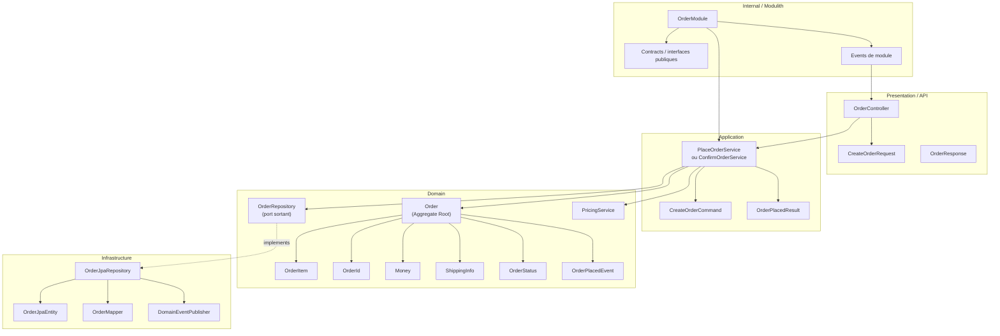

# Domaine Order

## Vue synthétique DDD + Modulith

Cette vue décrit l’organisation du bounded context Order selon une logique DDD, avec une lecture simple de l’architecture modulith : chaque couche a une responsabilité claire, et les dépendances restent dirigées.

## Lecture du schéma

- La couche Presentation expose les cas d’usage au monde extérieur.
- La couche Application orchestre le métier sans contenir la logique métier elle-même.
- La couche Domain contient l’agrégat Order, ses objets de valeur, ses règles de transition et ses événements métier.
- La couche Infrastructure implémente les ports du domaine et gère la persistence, les mappers et la publication d’événements.
- Le cadre Internal / Modulith représente la frontière du module Order : il expose uniquement ce qui est utile aux autres modules et garde la logique interne encapsulée.

## Règle de dépendance essentielle

Le sens des dépendances est volontairement unidirectionnel :

Presentation → Application → Domain ← Infrastructure

Cette organisation permet de garder le domaine indépendant des détails techniques, tout en laissant la modularité du système explicite et maîtrisée.
