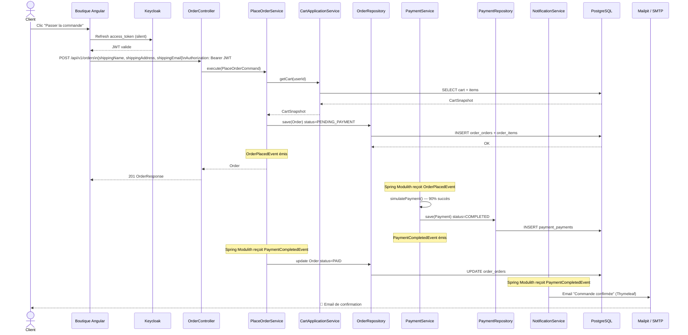

# Séquence — Passage de commande (checkout)

Flux complet depuis le clic "Commander" jusqu'à l'email de confirmation.

```mermaid
sequenceDiagram
    actor C as Client
    participant FC as Boutique Angular
    participant KC as Keycloak
    participant OC as OrderController
    participant POS as PlaceOrderService
    participant CAS as CartApplicationService
    participant OR as OrderRepository
    participant PP as PaymentService
    participant PR as PaymentRepository
    participant NT as NotificationService
    participant PG as PostgreSQL
    participant ML as Mailpit / SMTP

    C->>FC: Clic "Passer la commande"
    FC->>KC: Refresh access_token (silent)
    KC-->>FC: JWT valide

    FC->>OC: POST /api/v1/orders\n{shippingName, shippingAddress, shippingEmail}\nAuthorization: Bearer JWT

    OC->>POS: execute(PlaceOrderCommand)
    POS->>CAS: getCart(userId)
    CAS->>PG: SELECT cart + items
    PG-->>CAS: CartSnapshot
    CAS-->>POS: CartSnapshot

    POS->>OR: save(Order) status=PENDING_PAYMENT
    OR->>PG: INSERT order_orders + order_items
    PG-->>OR: OK
    Note over POS: OrderPlacedEvent émis

    POS-->>OC: Order
    OC-->>FC: 201 OrderResponse

    Note over PP: Spring Modulith reçoit OrderPlacedEvent
    PP->>PP: simulatePayment() — 90% succès
    PP->>PR: save(Payment) status=COMPLETED
    PR->>PG: INSERT payment_payments
    Note over PP: PaymentCompletedEvent émis

    Note over POS: Spring Modulith reçoit PaymentCompletedEvent
    POS->>OR: update Order status=PAID
    OR->>PG: UPDATE order_orders

    Note over NT: Spring Modulith reçoit PaymentCompletedEvent
    NT->>ML: Email "Commande confirmée" (Thymeleaf)
    ML-->>C: 📧 Email de confirmation
```
