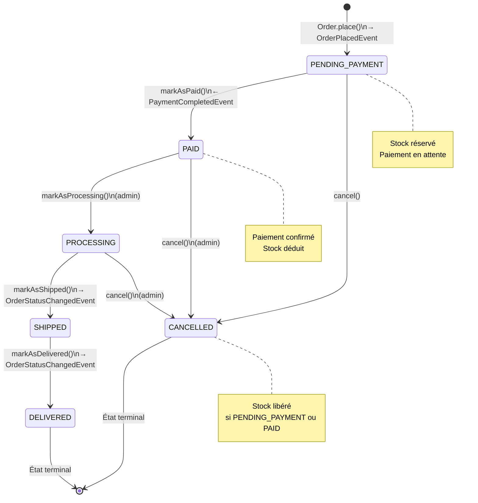

# Machine d'états — Commande (Order)

Cycle de vie complet d'une commande, avec les événements déclencheurs.

```mermaid
stateDiagram-v2
    [*] --> PENDING_PAYMENT : Order.place()\n→ OrderPlacedEvent

    PENDING_PAYMENT --> PAID : markAsPaid()\n← PaymentCompletedEvent
    PENDING_PAYMENT --> CANCELLED : cancel()

    PAID --> PROCESSING : markAsProcessing()\n(admin)
    PAID --> CANCELLED : cancel()\n(admin)

    PROCESSING --> SHIPPED : markAsShipped()\n→ OrderStatusChangedEvent
    PROCESSING --> CANCELLED : cancel()\n(admin)

    SHIPPED --> DELIVERED : markAsDelivered()\n→ OrderStatusChangedEvent

    DELIVERED --> [*] : État terminal
    CANCELLED --> [*] : État terminal

    note right of PENDING_PAYMENT
        Stock réservé
        Paiement en attente
    end note

    note right of PAID
        Paiement confirmé
        Stock déduit
    end note

    note right of CANCELLED
        Stock libéré
        si PENDING_PAYMENT ou PAID
    end note
```
