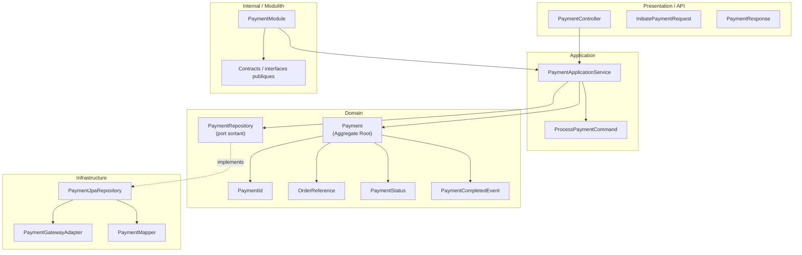

# Domaine Payment

## Vue synthétique DDD + Modulith

Ce diagramme présente le bounded context Payment comme un module centré sur un agrégat de paiement, avec une frontière claire entre logique métier, orchestration applicative et intégration technique.

## Lecture du schéma

- La couche Presentation expose les opérations d’initiation et de suivi d’un paiement.
- La couche Application orchestre l’exécution du paiement sans contenir la logique de validation métier.
- La couche Domain contient l’agrégat Payment, son état et ses événements métier.
- La couche Infrastructure implémente le repository et l’intégration avec le prestataire de paiement.
- Le cadre Internal / Modulith isole le module Payment et expose seulement les interfaces utiles aux autres modules.

## Règle de dépendance essentielle

Le module respecte la direction suivante :

Presentation → Application → Domain ← Infrastructure

Cette séparation permet au domaine de rester cohérent, même si le traitement externe du paiement dépend de services tiers.
