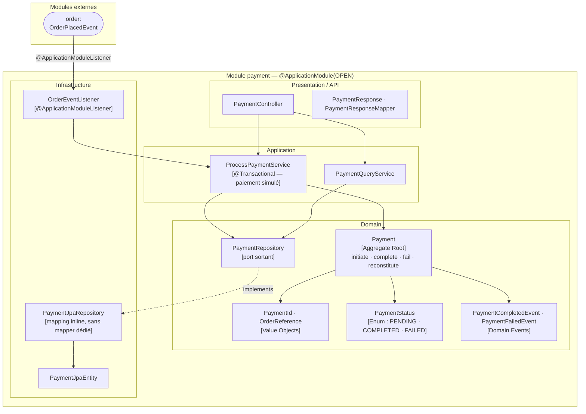

# Domaine Payment

## Vue synthétique DDD + Modulith

Le bounded context Payment traite automatiquement le paiement d'une commande. Dès qu'un `OrderPlacedEvent` est reçu, le module initie et simule le paiement (cf. ADR-0007 — pas de passerelle réelle), puis publie le résultat via `PaymentCompletedEvent` ou `PaymentFailedEvent`. Ces événements déclenchent en retour la mise à jour du statut de la commande et l'envoi de notifications.



## Concepts DDD dans ce module

| Concept | Présent | Note |
|---|---|---|
| Aggregate Root | `Payment` | Transitions : `initiate` → `complete` ou `fail` |
| Value Objects | `PaymentId`, `OrderReference` | `OrderReference` est un snapshot de l'identifiant de commande |
| Domain Events | `PaymentCompletedEvent`, `PaymentFailedEvent` | Consommés par `order` et `notification` |
| Repository (port) | `PaymentRepository` | Interface dans le domaine |
| Mapper JPA | Absent | Le mapping est réalisé directement dans `PaymentJpaRepository` |
| Domain Events consommés | `OrderPlacedEvent` | Via `OrderEventListener` → déclenche `ProcessPaymentService` automatiquement |

## Contraintes Modulith

- **Type** : `OPEN`
- **allowedDependencies** : `order` — autorise l'écoute de `OrderPlacedEvent`
- Le flux est entièrement événementiel : l'utilisateur ne déclenche pas manuellement le paiement
- Le paiement est simulé (ADR-0007) : pas de passerelle externe, résultat aléatoire ou fixe selon l'environnement

## Flux événementiel

```
order ──OrderPlacedEvent──▶ payment ──PaymentCompletedEvent──▶ order, notification
                                    └──PaymentFailedEvent────▶ order, notification
```

## Règle de dépendance

```
Presentation → Application → Domain ← Infrastructure
```

Le domaine décrit les transitions métier du paiement sans dépendre de Spring ni de JPA. L'infrastructure gère la persistence et l'écoute des événements entrants.
