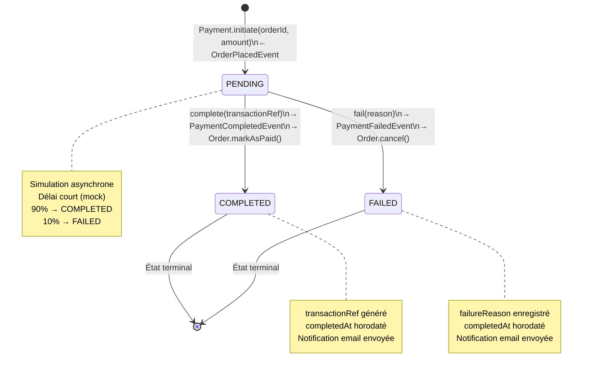

# Machine d'états — Paiement (Payment)

Cycle de vie d'un paiement simulé (90% de succès).

```mermaid
stateDiagram-v2
    [*] --> PENDING : Payment.initiate(orderId, amount)\n← OrderPlacedEvent

    PENDING --> COMPLETED : complete(transactionRef)\n→ PaymentCompletedEvent\n→ Order.markAsPaid()

    PENDING --> FAILED : fail(reason)\n→ PaymentFailedEvent\n→ Order.cancel()

    COMPLETED --> [*] : État terminal
    FAILED --> [*] : État terminal

    note right of PENDING
        Simulation asynchrone
        Délai court (mock)
        90% → COMPLETED
        10% → FAILED
    end note

    note right of COMPLETED
        transactionRef généré
        completedAt horodaté
        Notification email envoyée
    end note

    note right of FAILED
        failureReason enregistré
        completedAt horodaté
        Notification email envoyée
    end note
```
