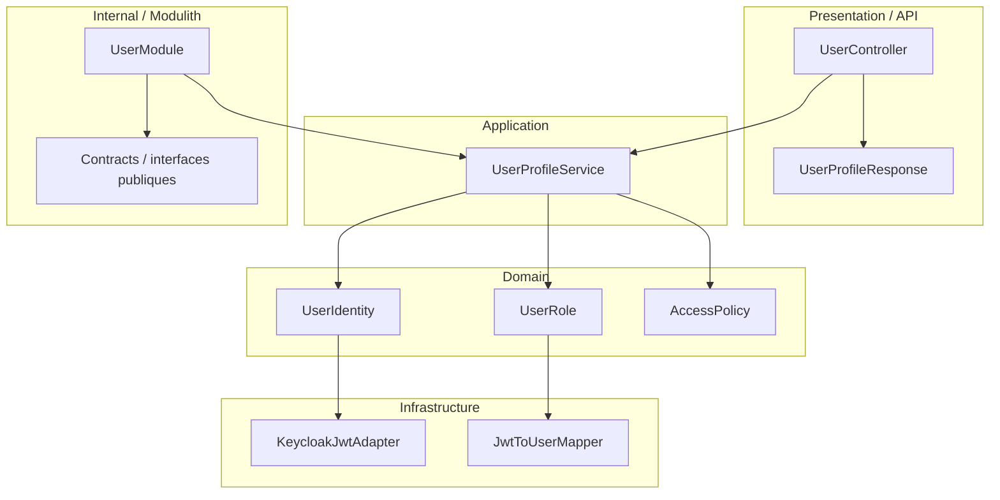

# Domaine User

## Vue synthétique DDD + Modulith

Le domaine User est actuellement relativement fin : il expose surtout l’identité et les rôles de l’utilisateur connectée à partir d’un contexte d’authentification externe.

## Lecture du schéma

- La couche Presentation expose les informations de profil utilisateur.
- La couche Application orchestre l’interprétation du contexte d’authentification.
- La couche Domain contient les concepts d’identité, de rôle et de politique d’accès.
- La couche Infrastructure implémente l’adaptation à Keycloak et la transformation du token en structure métier.
- Le cadre Internal / Modulith définit la frontière du module User.

## Règle de dépendance essentielle

Le domaine respecte une logique simple et directe :

Presentation → Application → Domain ← Infrastructure

Même s’il n’a pas d’agrégat complexe, il reste structuré pour éviter l’éparpillement de la logique d’authentification dans les autres modules.
