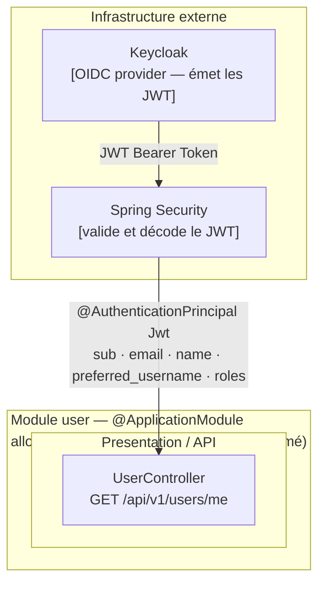

# Domaine User

## Vue synthétique DDD + Modulith

Le module User est **intentionnellement minimal**. Il n'a ni couche Domain, ni Application, ni Infrastructure propres. Son seul rôle est d'exposer l'identité et les rôles de l'utilisateur connecté, extraits directement du JWT Keycloak injecté par Spring Security. L'authentification et la gestion des utilisateurs sont déléguées entièrement à Keycloak (cf. ADR-0003).

## Concepts DDD dans ce module

| Concept | Présent | Note |
|---|---|---|
| Aggregate Root | Non | Aucun état métier — lecture pure du contexte de sécurité |
| Domain Events | Non | Aucun événement publié ou consommé |
| Application Service | Non | Le contrôleur lit directement le JWT injecté |
| Infrastructure | Non | Spring Security + Keycloak gèrent l'ensemble en dehors du module |

## Contraintes Modulith

- **Type** : standard (non `OPEN`) — aucun autre module ne dépend du module `user`
- **allowedDependencies** : aucune — module complètement isolé des autres bounded contexts
- L'identité utilisateur (`userId`, `roles`) circule dans les autres modules sous forme de `String` extraite du JWT, pas via un objet du domaine `user`

## Particularité architecturale

Ce module représente le **contexte d'identité délégué à Keycloak**. La décision de ne pas modéliser un domaine `User` riche est intentionnelle : créer un agrégat `User` localement dupliquerait ce que Keycloak gère déjà (cycle de vie, mot de passe, rôles, SSO). Ce pattern correspond à un **ACL (Anti-Corruption Layer) minimal** : le JWT est la surface d'intégration.
